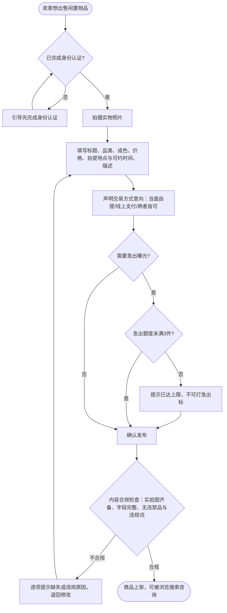
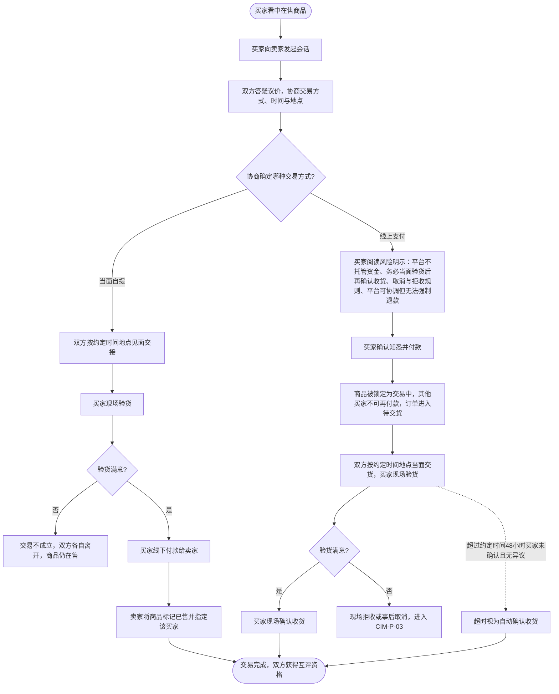
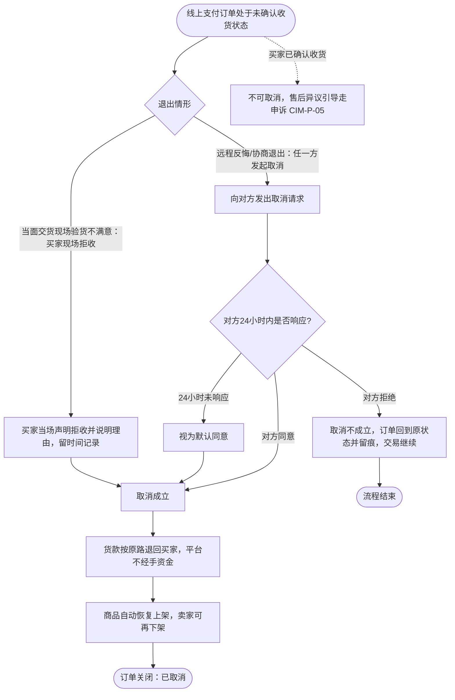
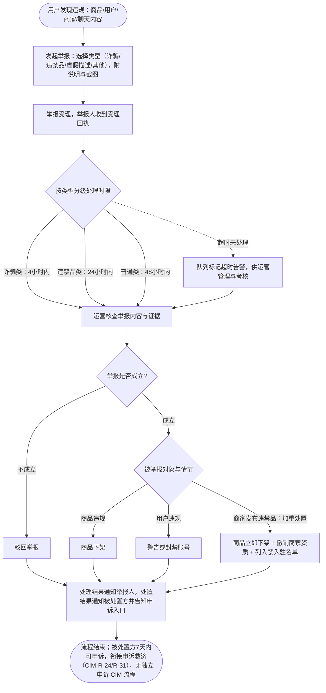
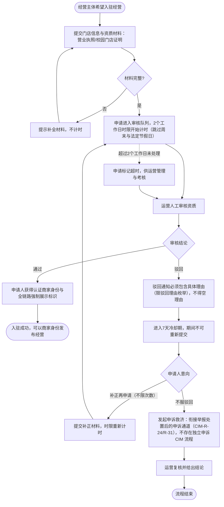
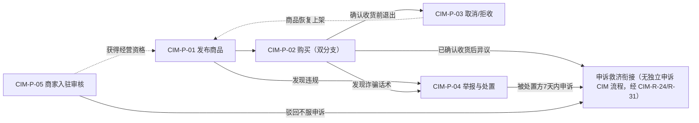

# CIM 业务流程与规则

- **模型层级**：CIM（计算无关模型，纯业务视角，不含任何系统/技术概念）
- **版本**：v1.0
- **作者**：mda-engineer
- **日期**：2026-02-06
- **状态**：已发布（CEO 审核通过 2026-02-06）
- **输入来源**：
  - `docs/prd/2026-02-06-校园二手平台完整PRD.md` v1.0（冻结）：§4 用户场景与旅程、§5 功能需求（F1-F39）、§7 非功能口径、§10 十条裁决
  - `Modeling/ontology/领域本体.md` v1.0（ONT-01~20，口径常量索引）
  - `Modeling/cim/业务领域模型.md` v1.0（CIM-E-01~10，流程作用对象）
- **转换留痕**：从本体层 + PRD 场景/功能条目映射而来。关键取舍：①ONT-04"交易"与 ONT-05"交接"两个业务过程概念在本层落地为流程（CIM-P-02 购买双分支），不再单设实体；②"取消"与"拒收"（ONT-17/18）语义上是同一退出边界的两种发起形态（共同边界=确认收货前），合并为一条流程 CIM-P-03 两个分支表达，24h 默认同意规则只挂取消分支；③流程只画业务动作与判断，系统自动化动作（如超时默认同意、自动确认收货）以"时间规则"节点表达，不预设由谁/什么系统触发；④PRD §4.5 四条边缘旅程中"被骗举报"与"纠纷申诉"分别并入 CIM-P-04 与规则引用，"游客转化认证"因属准入过程、动作简单，不单列流程，由规则 CIM-R-01/02 表达。

---

## 第一部分 核心业务流程（CIM-P-01 ~ CIM-P-05）

### CIM-P-01 发布商品流程

- **参与者**：卖家（学生/教职工/商家）
- **业务目标**：卖家把闲置物品以真实、合规的信息上架，供买家浏览购买。
- **来源**：F5、F22、F10a、N3、N7、§4.4 卖家旅程阶段②

- **关键规则引用**：CIM-R-01（未认证不可发布）、CIM-R-05（3 步发布）、CIM-R-06（实拍图与成色强制）、CIM-R-07（正面清单）、CIM-R-08（违禁拦截）、CIM-R-09（急出 3 件上限）。

### CIM-P-02 购买流程（当面自提 / 线上支付双分支）

- **参与者**：买家、卖家
- **业务目标**：双方协商一致并完成实物交接与货款交割，交易体面闭环。
- **来源**：F34、F7、F12、F13、F14、Q1/Q6、§4.2 场景四、§4.3 买家旅程③④

- **关键规则引用**：CIM-R-10（付款前强制风险明示）、CIM-R-11（付款锁商品防超卖）、CIM-R-12（48h 超时自动确认）、CIM-R-13（标记已售强制指定买家）、CIM-R-14（意向声明不强制约束现场分歧）、CIM-R-04（会话发起边界）。

### CIM-P-03 取消 / 拒收流程

- **参与者**：买家、卖家（共同边界：买家确认收货之前）
- **业务目标**：任一方在交易完成前体面退出，货款原路退回，商品回到可售状态。
- **来源**：F35、§10.2 口径确认 1、裁决 3/4、US-12

- **关键规则引用**：CIM-R-15（24h 默认同意，双向同规则）、CIM-R-16（原路退款、平台不经手资金）、CIM-R-17（取消成功商品恢复上架）、CIM-R-18（已确认收货不可取消）、CIM-R-19（拒收必须现场留痕）。

### CIM-P-04 举报与处置流程

- **参与者**：举报人（用户）、运营人员、被举报方
- **业务目标**：违规行为被及时发现、按时限处置、结果闭环通知，举报人全程匿名。
- **来源**：F18、F20、F21、N2/N3/N6、§4.5 边缘旅程一

- **关键规则引用**：CIM-R-20（举报人匿名保护）、CIM-R-21（分级处理时限 4/24/48h）、CIM-R-22（处理结果四枚举）、CIM-R-23（商家违禁品加重处置三件套）、CIM-R-24（处置后 7 天申诉权）。

### CIM-P-05 商家入驻审核流程

- **参与者**：商家申请人、运营人员
- **业务目标**：经营主体资质真实合规后方可入驻经营，审核过程透明、时限明确、驳回可救济。
- **来源**：F32、F33、§8.5、裁决 9、§4.5 边缘旅程三

- **关键规则引用**：CIM-R-25（2 个工作日 SLA 计时口径）、CIM-R-26（驳回必给理由枚举）、CIM-R-27（7 天冷却不限次补正）、CIM-R-28（商家全链路强制亮标）、CIM-R-23（造假/违禁转入加重处置与禁入驻名单）。

---

## 第二部分 业务规则清单（CIM-R-01 ~ CIM-R-28）

> 每条规则注明：来源（F 编号 + PRD 章节）、涉及流程。数值口径均逐字引用冻结 PRD 与十条裁决。

| 编号 | 业务规则 | 来源 | 涉及流程 |
|---|---|---|---|
| CIM-R-01 | 未完成身份认证的用户仅可浏览商品列表与详情，不可发布、不可发起会话、不可交易、不可举报；受限操作 100% 拦截并引导认证。 | F1 §5.1、N1 §7 | CIM-P-01、CIM-P-02 |
| CIM-R-02 | 学生认证首期仅限本校名单内学校；名单外学校一律提示"暂不支持"，可提交加入申请。 | F1 AC3、F36 §5.1、§10.3 | CIM-P-01（前置准入） |
| CIM-R-03 | 教职工 MVP 阶段完全沿用学生规则；不适用毕业处置；主页展示教职工身份标识。 | F1 裁决 10 §10.4、§3.3 | CIM-P-01、CIM-P-02 |
| CIM-R-04 | 已下架或已售商品不可被发起新会话；被拉黑方不可向拉黑方发起会话。 | F7 AC2、F12 AC2、F29 §5.3 | CIM-P-02 |
| CIM-R-05 | 发布流程不得超过 3 步（拍照→填写信息→确认发布）。 | F5、N7 §7 | CIM-P-01 |
| CIM-R-06 | 发布必须上传实拍图并选择规范成色；缺失即拦截并逐项提示。 | F5 AC2、N5 §7 | CIM-P-01 |
| CIM-R-07 | 商品分类只能选自品类正面清单；虚拟商品与服务类不可发布。 | F5、Q5、§8.4、O5 §9 | CIM-P-01 |
| CIM-R-08 | 发布、资料编辑、留言等文本命中违规词表或违禁品清单一律拦截，拦截记录留痕供运营复核。 | F22 §5.5、N3 §7 | CIM-P-01、CIM-P-04 |
| CIM-R-09 | 急出标签同账号同时生效上限 3 件；商品售出或下架均释放额度；商家商品不享受急出加权。 | F10a §5.2、裁决 7 | CIM-P-01 |
| CIM-R-10 | 线上支付付款前必须向买家明示三要素："平台不托管资金，务必当面验货后再确认收货"、取消/拒收规则摘要、"平台可协调但无法强制退款"；未确认不得付款。 | F13 AC2、F30 AC2、N8 §7 | CIM-P-02 |
| CIM-R-11 | 线上支付付款成功后商品锁定为"交易中"，其他买家不可再付款（防超卖）。 | F34 AC1 §5.3 | CIM-P-02 |
| CIM-R-12 | 交货约定时间后 48 小时买家未确认且无异议，自动确认收货；未录入约定时间时以付款成功时刻 +48 小时起算。 | F35 AC3、裁决 4 | CIM-P-02 |
| CIM-R-13 | 卖家标记已售必须指定买家，未指定即拦截；被指定买家获得评价入口；已售不可逆且退出搜索结果。 | F7 AC1/AC3、Q6 §5.2 | CIM-P-02 |
| CIM-R-14 | 发布时的交易方式仅为意向声明；现场分歧以会话内最后一条双方均确认的记录为准，无确认记录时以发布时声明为准。 | F34 AC4、裁决 2 | CIM-P-02 |
| CIM-R-15 | 取消仅限未确认收货状态；对方 24 小时未响应视为默认同意（自发起时刻起算，买卖双方同一规则）；被拒绝后订单回到原状态并留痕。 | F35 AC1、裁决 3 | CIM-P-03 |
| CIM-R-16 | 取消成立退款原路退回；平台不经手资金，仅发起退回指令；平台不做资金托管/担保。 | F35、O10 §9 | CIM-P-03 |
| CIM-R-17 | 取消成功后商品自动恢复上架，卖家可再下架。 | F35 §5.3 | CIM-P-03 |
| CIM-R-18 | 买家确认收货后不可取消；售后异议引导至申诉通道；订单"已完成"不可逆。 | F35 AC2、F30、裁决 8 | CIM-P-03、CIM-P-05 |
| CIM-R-19 | 拒收必须在当面交货现场发起并留痕（时间+说明）；拒收后订单进入取消流程并原路退款。 | F35 AC4 §5.3 | CIM-P-03 |
| CIM-R-20 | 举报人身份对被举报方全程不可见；通知、详情、处理记录全链路泄露点数为 0。 | F18 AC2、N6 §7 | CIM-P-04 |
| CIM-R-21 | 举报分级处理时限：诈骗类 4 小时、违禁品类 24 小时、普通 48 小时；超时在队列中标记告警。 | F20 §5.5、N2 §7 | CIM-P-04 |
| CIM-R-22 | 举报处理结果仅可从 下架/警告/封禁/驳回 四者中选择；结果须通知举报人。 | F20 AC2 §5.5 | CIM-P-04 |
| CIM-R-23 | 商家发布违禁品加重处置三件套：立即下架 + 撤销资质 + 列入禁入驻名单（再次申请入驻被拦截）。 | F21 AC1 §5.5、N3 §7 | CIM-P-04、CIM-P-05 |
| CIM-R-24 | 被处置（警告/封禁/撤销资质/差评）的账号或商家可在收到处置通知后 7 天内申诉，逾期申诉入口关闭。 | F31 §5.4 | CIM-P-04、CIM-P-05 |
| CIM-R-25 | 商家入驻审核时限 2 个工作日，自材料完整提交起算，跳过周末与法定节假日；补正后计时重置；超时标记。 | F32 AC3、裁决 9 | CIM-P-05 |
| CIM-R-26 | 商家入驻驳回必须给出驳回理由枚举中的具体理由，可补充说明，不得空理由驳回。 | F32 AC2、§8.5 | CIM-P-05 |
| CIM-R-27 | 商家入驻驳回后 7 天冷却期内不可重新提交；冷却后可补正再申请，不限次数。 | F32 §5.1 | CIM-P-05 |
| CIM-R-28 | 商家不得以个人身份发布商品；"认证商家"标识在列表、详情、会话、主页全链路强制可见（对游客同样可见）。 | F33 §5.1、N1 §7 | CIM-P-01、CIM-P-05 |

### 补充规则（评价与申诉类，供后续 PIM 状态机引用）

| 编号 | 业务规则 | 来源 | 涉及流程 |
|---|---|---|---|
| CIM-R-29 | 交易完成后 7 天内双方可互评；逾期一方未评按默认好评计入对方评分。 | F17 AC2 §5.4 | CIM-P-02（收尾） |
| CIM-R-30 | 评价延迟公开：双方均提交或评价期结束后统一公开；订单"申诉中"期间评价入口冻结，结案后恢复。 | F17 AC1、裁决 8 | CIM-P-02（收尾） |
| CIM-R-31 | 交易纠纷申诉（卖家失联/错标已售/货不对板）运营 48 小时内介入裁决并通知双方；线上支付纠纷平台可协调但无法强制退款（事前已明示）。 | F30 §5.4、§4.5 边缘旅程二 | CIM-P-03（售后衔接） |
| CIM-R-32 | 聊天内容命中风险词表时发送侧弹警示，可继续发送但留痕（留痕五字段：发送人、接收人、命中词、时间、消息原文）；未命中不留痕；留痕仅供运营依授权流程调阅。 | F13、裁决 1、N6/N9 | CIM-P-02、CIM-P-04 |
| CIM-R-33 | 求购默认有效期 30 天，续期不限次每次 +30 天；第 27 天到期提醒；关闭或标记"已买到"后立即停止一切撮合通知。 | F9、裁决 6 | CIM-P-01（反向） |
| CIM-R-34 | 聊天、订单、举报记录自产生之日起留存不少于 90 天；注销用户会话记录同口径；运营调阅必留痕。 | N9 §7、F26 | CIM-P-02、CIM-P-04 |
| CIM-R-35 | 学生认证按学制有效；毕业后进入 30 天清仓期（自到期通知发出起算）；存在在途交易时延后处置上限 30 天，与清仓期独立计算。 | F27、裁决 5 | CIM-P-01（资格变化） |
| CIM-R-36 | 个人账号单日发布 ≥5 件、跨 ≥3 个品类、疑似商家未入驻而以个人身份发布，触发黄牛预警进人工复核；已入驻商家不按黄牛处理。 | F23 §5.5 | CIM-P-01 |

> 说明：规则编号 CIM-R-01~28 对应第一至第五主流程，CIM-R-29~36 为跨流程补充规则（评价、申诉、风控、留存、资格生命周期），同样遵循"编号不复用不改号"纪律。

---

## 第三部分 流程间关系

- CIM-P-02 是唯一产生"订单"实体的流程；CIM-P-03 是订单终态"已取消"的唯一来源；CIM-P-04 处置结果可改变商品与用户状态；CIM-P-05 是商家身份的唯一来源。
- 下游：PIM 将基于 CIM-P-02/03 建立订单五态状态机（PIM-SM-01），基于 CIM-P-01 建立商品四态状态机，规则 CIM-R-xx 将形式化为状态迁移守卫条件。
