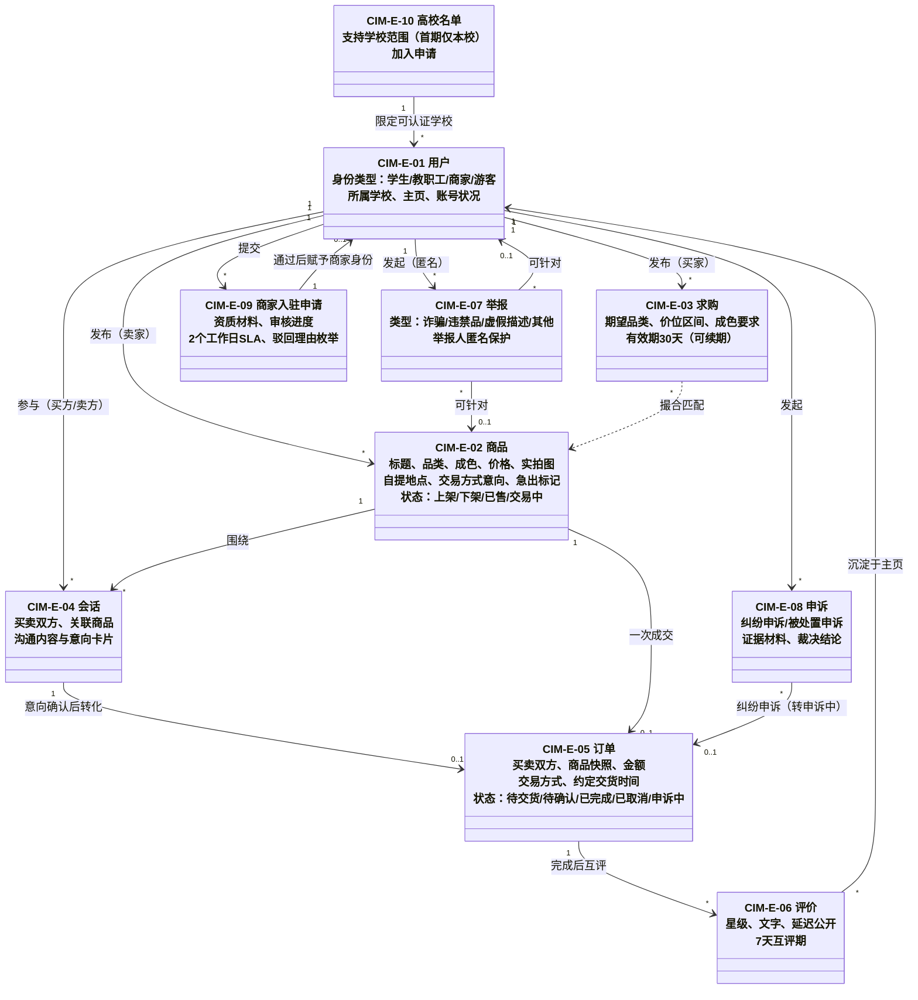

# CIM 业务领域模型：业务实体及关系

- **模型层级**：CIM（计算无关模型，纯业务视角，不含任何系统/技术概念）
- **版本**：v1.0
- **作者**：mda-engineer
- **日期**：2026-02-06
- **状态**：已发布（CEO 审核通过 2026-02-06）
- **输入来源**：
  - `docs/prd/2026-02-06-校园二手平台完整PRD.md` v1.0（冻结）：§3 角色、§4 场景与旅程、§5 功能需求
  - `Modeling/ontology/领域本体.md` v1.0（ONT-01~20，语义对齐基准）
- **转换留痕**：从本体层（ONT-01~20）+ PRD 映射而来。关键取舍：①ONT 中"交易（ONT-04）"与"交接（ONT-05）"为业务过程/活动，不是可独立存在的业务对象，本层不作为实体建模，改由流程文件（CIM-P-xx）承载，避免与订单（CIM-E-05）语义重叠；②"商家入驻申请"与"高校名单"在 ONT 中未单列（前者隐含于 ONT-09 身份认证，后者为 F36 配置对象），但二者均有独立业务生命周期（审核流转、名单增减），故升为 CIM 实体（CIM-E-09/10），语义回指 ONT-09 与 F36；③ON T-08 的"账号/用户"区分属系统层概念，CIM 只保留业务主体"用户"，账号概念留给 PIM；④ON T-07 消息作为会话的组成内容一并描述，不单列实体编号（避免 CIM 过细，PIM 聚合中再切分）。

---

## 1. 实体总览

| 编号 | 业务实体 | 职责一句话 | 语义对齐 | 主要来源 |
|---|---|---|---|---|
| CIM-E-01 | 用户 | 平台参与者（买方/卖方/经营方）的业务主体 | ONT-08/10/11/12/13 | F1/F2、§3 |
| CIM-E-02 | 商品 | 待出售的实物闲置物品的信息载体 | ONT-01 | F5/F6/F7/F10a |
| CIM-E-03 | 求购 | 买家发布的反向需求信息 | ONT-02 | F9 |
| CIM-E-04 | 会话 | 买卖双方围绕商品的沟通通道 | ONT-06（含 ONT-07 消息） | F12/F13/F14 |
| CIM-E-05 | 订单 | 一笔买卖约定的事实记录与状态载体 | ONT-03 | F34/F35 |
| CIM-E-06 | 评价 | 交易完成后双方互留的信用记录 | ONT-14 | F17 |
| CIM-E-07 | 举报 | 用户向运营提交的违规指控 | ONT-15 | F18/F20 |
| CIM-E-08 | 申诉 | 用户对交易结果或平台处置的救济请求 | ONT-16 | F30/F31 |
| CIM-E-09 | 商家入驻申请 | 经营主体入驻平台的资质申请与审核过程记录 | ONT-09（商家通道） | F32/F33 |
| CIM-E-10 | 高校名单 | 平台认可的可认证学校范围 | F36 配置对象 | F36、§10.3 |

---

## 2. 实体详述

### CIM-E-01 用户

- **职责**：平台中一切业务行为（发布、购买、沟通、交易、评价、举报、申诉）的发出方与接收方；其身份类型决定权限边界。
- **关键属性（业务语言）**：身份类型（学生/教职工/商家/游客）、昵称与头像、个人简介、所属学校、公开主页、账号当前状况（正常/被封禁/只读/清仓中/已注销）。
- **生命周期**：游客（未认证）→ 经身份认证获得学生/教职工/商家角色 → 正常参与业务 →（学生毕业时）进入 30 天清仓期 → 转只读或注销；违规可被警告/封禁，经申诉可复核恢复。
- **关系**：发布商品（CIM-E-02）与求购（CIM-E-03）；作为会话（CIM-E-04）双方之一；作为订单（CIM-E-05）买方或卖方；给出与收到评价（CIM-E-06）；发起举报（CIM-E-07）与申诉（CIM-E-08）；商家身份经入驻申请（CIM-E-09）获得；可认证学校范围由高校名单（CIM-E-10）限定。
- **业务约束**：实名信息（学号、资质材料）不出现在任何公开场合（N6）；游客仅可浏览（N1）；教职工 MVP 阶段完全沿用学生规则（裁决 10）。

### CIM-E-02 商品

- **职责**：卖家闲置物品对外展示与交易的标的，是浏览、搜索、咨询、下单的入口对象。
- **关键属性**：标题、所属品类（限正面清单叶子品类）、成色、价格、实拍照片（必须有）、自提地点与可约时间、描述、交易方式意向（当面自提/线上支付/两者皆可）、是否急出。
- **生命周期**：发布即上架 → 可下架（可恢复上架）→ 线上支付付款成功后被锁定"交易中"→ 成交后标记已售（须指定买家，不可逆）；取消成功自动恢复上架。状态口径：**上架/下架/已售/交易中**（语义对齐 ONT-01）。
- **关系**：属于一个卖家用户；一件商品一次成交对应一个订单；可被收藏、被举报；与求购构成撮合对。
- **业务约束**：虚拟商品与服务类不可发布（O5/§8.3）；急出标签同账号同时生效上限 3 件（F10a）；商家商品不享受急出加权；已下架/已售商品不可被发起新咨询（F7/F12）。

### CIM-E-03 求购

- **职责**：买家"想买某物"的公开需求表达，用于反向撮合——让卖家或平台把匹配的在售商品推给求购者。
- **关键属性**：期望品类、预期价位区间、成色要求、补充描述、有效期。
- **生命周期**：发布生效（默认 30 天）→ 可不限次续期（每次 +30 天）→ 到期前 3 天（第 27 天）提醒 → 到期失效 / 手动关闭 / 标记"已买到"，任一终态立即停止一切撮合通知。
- **关系**：发布者为买家用户；与在售商品构成撮合对；撮合命中产生给求购者的通知。

### CIM-E-04 会话

- **职责**：一对买卖双方围绕某件商品建立的沟通通道，承载答疑、议价、交易方式协商与交易意向确认。
- **关键属性**：买方、卖方、关联商品、沟通内容（文字、图片、交易意向卡片）、双方未读情况。
- **生命周期**：由买方对在售商品发起而建立 → 协商过程（可含意向卡片的双向确认）→ 可转化出订单；随订单完结而归档，沟通记录按规则留存 ≥90 天。
- **关系**：由消息内容组成；是订单的来源场景；是举报与申诉的入口场景之一；命中风险词的沟通内容产生安全警示留痕。
- **业务约束**：未认证用户不可发起（N1）；已下架/已售商品不可发起新会话（F12）；被拉黑方不可向拉黑方发起（F29）。

### CIM-E-05 订单

- **职责**：一笔具体买卖约定的事实记录，是交易过程的留痕载体；双方权利义务（交货、确认、退款、评价资格）以订单状态为准。
- **关键属性**：买方、卖方、成交商品的信息快照、交易方式（当面自提/线上支付）、金额、约定交货时间与地点、当前状态。
- **生命周期（五态，逐字对齐 PRD F34）**：**待交货 → 待确认 → 已完成**；确认收货前任一方取消 → **已取消**；发生纠纷申诉 → **申诉中**（结案后回原流转）。不存在其他状态；"已完成"不可逆。
- **关系**：由会话中的交易意向转化而来；关联一件商品；是评价、申诉、取消、拒收、确认收货的作用对象。
- **业务约束**：线上支付付款成功即锁商品；交货约定时间后 48 小时未确认且无异议自动完成；取消需对方 24 小时内响应否则默认同意；取消成功原路退款且商品恢复上架。

### CIM-E-06 评价

- **职责**：交易完成后买卖双方互留的信用记录（星级+文字），沉淀于被评价方主页，构成平台信任基础。
- **关键属性**：评价方、被评价方、关联订单、星级、文字内容、是否已公开。
- **生命周期**：订单完成后 7 天内可提交 → **延迟公开**（双方均提交或评价期届满后统一公开）→ 公开后沉淀于主页；差评可被申诉，申诉期间公开展示按运营裁定。
- **关系**：依附于已完成订单；被评价方为用户；是申诉（被处置申诉类）的可能对象。

### CIM-E-07 举报

- **职责**：用户对商品/用户/商家/聊天内容违规行为的指控，是平台治理的输入。
- **关键属性**：举报人、被举报对象、类型（诈骗/违禁品/虚假描述/其他）、补充说明与截图、处理状态与结果。
- **生命周期**：提交受理 → 进入运营处理队列（按类型分级时限：诈骗 4 小时/违禁品 24 小时/普通 48 小时）→ 处理（结果枚举：下架/警告/封禁/驳回）→ 结果通知举报人。
- **关系**：举报人为用户；对象为商品或用户；处理不当可引发被处置方申诉。
- **业务约束**：举报人身份对被举报方全程不可见（匿名保护，N6）。

### CIM-E-08 申诉

- **职责**：用户对交易结果或平台处置不服时的救济请求，分交易纠纷申诉与被处置申诉两类。
- **关键属性**：申诉人、申诉类型（卖家失联/错标已售/货不对板/误封复核等）、证据材料（聊天记录/付款凭证/约定信息）、处理状态与裁决结论。
- **生命周期**：发起（交易纠纷随时；被处置申诉限收到处置通知后 7 天内）→ 运营 48 小时内介入 → 裁决并通知双方 → 结案。
- **关系**：作用于订单（订单转"申诉中"，评价入口冻结）或处置记录；由运营裁决。
- **业务约束**：线上支付纠纷"平台可协调但无法强制退款"须在付款前明示（N8）；逾期申诉入口关闭。

### CIM-E-09 商家入驻申请

- **职责**：经营主体进入平台的资质审核过程记录，决定申请人能否获得商家身份。
- **关键属性**：申请人、门店信息、资质材料（营业执照/校园门店证明）、审核进度（待审核/审核中/通过/驳回）、驳回理由（限 §8.5 枚举）。
- **生命周期**：材料提交 → 完整性确认后 SLA 计时（2 个工作日，跳节假日）→ 审核中 → 通过（获得商家身份与"认证商家"标识）/ 驳回（必给具体理由）→ 驳回后 7 天冷却 → 可补正再申请（不限次，补正后计时重置）；超 2 个工作日未处理标记超时。
- **关系**：申请人为用户；审核通过产出商家身份（作用于 CIM-E-01）；造假类驳回联动禁入驻名单（F21）；驳回不服可走申诉（CIM-E-08）。
- **语义对齐**：ONT-09 身份认证的商家通道；本层将其过程性单列为实体，便于表达 SLA 与冷却规则。

### CIM-E-10 高校名单

- **职责**：平台认可的可认证学校范围，决定学生/教职工认证的准入边界。
- **关键属性**：学校名称、是否在支持范围内、名单外学校的加入申请记录。
- **生命周期**：首期=本校单校 → 运营可在运营稳定后新增学校（同城高校扩展）→ 学校可被停用；名单外学校用户可提交加入申请。
- **关系**：限定用户认证（CIM-E-01）的学校选择；由运营维护。
- **业务约束**：首期仅本校（§10.3 排期裁决）；名单外学校认证一律提示"暂不支持"（F36/N1）。

---

## 3. 业务实体关系图

> 注：图中不出现任何技术类型/主外键；多重性仅表达业务常识（如"一件商品一次成交对应一个订单"）。取消/拒收/确认收货/标记已售为作用于订单与商品的业务动作，在 `业务流程与规则.md`（CIM-P/CIM-R）与后续 PIM 状态机中表达。

## 4. 与其他模型文件的关系

- 语义基准：`ontology/领域本体.md`（本文件全部实体回指 ONT 编号）。
- 流程与规则：见 `cim/业务流程与规则.md`（CIM-P-01~05、CIM-R-01~18），本文件只描述"有什么、什么关系、活多久"，不描述"怎么走"。
- 下游：PIM 将按限界上下文重组以上实体为聚合（如订单聚合、商品聚合），实体间关系的多重性与生命周期约束是 PIM 聚合边界划分的直接输入。
