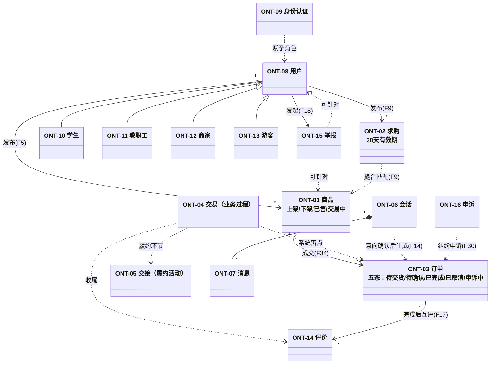

# 领域本体（Ontology）：校园二手交易平台核心概念严格定义

- **模型层级**：本体层（Ontology，语义地基，贯穿 CIM/PIM/PSM）
- **版本**：v1.0
- **作者**：mda-engineer
- **日期**：2026-02-06
- **状态**：已发布（CEO 审核通过 2026-02-06）
- **输入来源**：`docs/prd/2026-02-06-校园二手平台完整PRD.md` v1.0（冻结），全部规则口径（24h/48h/7 天/30 天等）逐字引用该文档
- **转换留痕**：本层为语义起点，无上游模型；下游 CIM 全部实体/流程/规则的命名与语义边界以本文件为唯一事实源。术语取舍：①"订单"采用 PRD F34 五态枚举为权威语义，"交易"降级为业务过程概念而非系统实体；②"账号"与"用户"按技术方案 §2.6"登录（设备层）/认证（业务层）分离"的口径切分。

---

## 1. 概念总览

| 编号 | 概念 | 类别 | 主要来源 |
|---|---|---|---|
| ONT-01 | 商品 | 核心实体 | F5/F6/F7/F10a |
| ONT-02 | 求购 | 核心实体 | F9 |
| ONT-03 | 订单 | 核心实体 | F34/F35 |
| ONT-04 | 交易 | 业务过程 | F34、§4.1 |
| ONT-05 | 交接 | 业务活动 | F34/F37 |
| ONT-06 | 会话 | 核心实体 | F12 |
| ONT-07 | 消息 | 核心实体 | F12/F13/F14 |
| ONT-08 | 用户 | 角色主体 | F1/F2、§3 |
| ONT-09 | 身份认证 | 业务过程 | F1/F32/F36 |
| ONT-10 | 学生 | 角色 | §3.1/§3.2、F1 |
| ONT-11 | 教职工 | 角色 | §3.3、F1 |
| ONT-12 | 商家 | 角色 | §3.4、F32/F33 |
| ONT-13 | 游客 | 角色 | §3.6、N1 |
| ONT-14 | 评价 | 核心实体 | F17 |
| ONT-15 | 举报 | 核心实体 | F18/F20 |
| ONT-16 | 申诉 | 核心实体 | F30/F31 |
| ONT-17 | 取消 | 业务动作 | F35 |
| ONT-18 | 拒收 | 业务动作 | F35 |
| ONT-19 | 确认收货 | 业务动作 | F34/F35 |
| ONT-20 | 标记已售 | 业务动作 | F7、Q6 |

---

## 2. 概念严格定义

### ONT-01 商品（Product）

- **定义**：卖家在平台发布的、供他人购买的**实物闲置物品**的信息载体（虚拟商品与服务按 O5/§8.3 明确排除）。
- **关键属性**：标题、分类（限 §8.4 正面清单叶子品类）、成色（规范枚举）、价格、实拍图（强制）、自提地点/可约时间、描述、交易方式意向声明（当面自提/线上支付/两者皆可）、急出标记。
- **状态（四态，PRD F7 三态 + F34 锁定态）**：
  - **上架（on_sale）**：可被搜索、浏览、发起会话与交易。
  - **下架（off_sale）**：卖家主动撤下；不可被发起新咨询（F7 AC2）；释放急出额度（裁决 7）。
  - **已售（sold）**：经 ONT-20 标记已售产生；默认退出搜索结果，详情页保留并显示"已售出"标识。
  - **交易中（trading，锁定态）**：线上支付付款成功后商品被锁定，其他买家不可再付款（防超卖，F34）；取消成功后自动恢复上架（F35）。
- **关系**：属于一个卖家（ONT-08）；属于一个叶子品类；可被收藏（F8）；可被举报（ONT-15）；一次成交对应一个订单（ONT-03）。
- **约束**：发布流程 ≤3 步（N7）；急出标签同账号同时生效上限 3 件（F10a）；商家商品不享受急出加权；分类必须在正面清单内（Q5）。

### ONT-02 求购（Want-Buy）

- **定义**：买家发布的"希望购入某类物品"的需求信息，用于卖家/系统反向撮合（Q7：首发包含，P0）。
- **关键属性**：品类、预期价位区间、成色要求、描述、有效期。
- **关系**：发布者为买家（ONT-08）；与在售商品（ONT-01）构成撮合对；撮合命中触发通知（F15）。
- **约束**：默认有效期 **30 天**；可续期、不限次数、每次续期延长 30 天（裁决 6）；到期前 3 天提醒（第 27 天）；手动关闭或标记"已买到"后立即停止一切撮合通知（F9）。

### ONT-03 订单（Order）

- **定义**：一笔具体买卖约定在平台内的**系统侧事实记录**，是交易过程（ONT-04）的留痕载体与状态机载体。
- **关键属性**：买卖双方、商品快照、交易方式（当面自提/线上支付）、金额、约定交货时间、状态。
- **状态（五态枚举，F34 AC3，不存在其他状态）**：**待交货 / 待确认 / 已完成 / 已取消 / 申诉中**。
- **关系**：由会话（ONT-06）中的交易意向（F14）转化而来；关联一个商品（ONT-01）；是评价（ONT-14）、申诉（ONT-16）、取消（ONT-17）、拒收（ONT-18）、确认收货（ONT-19）的作用对象。
- **约束**：线上支付付款成功 → 订单进入"待交货"且商品锁"交易中"；交货约定时间后 **48 小时**买家未确认且无异议 → 自动确认收货转"已完成"（F35）；未录入约定时间时以付款成功时刻 +48h 起算（裁决 4）；"已完成"不可逆（裁决 8）；进入"申诉中"冻结评价入口，结案后恢复（裁决 8）。

### ONT-04 交易（Transaction / Trade）

- **定义**：买卖双方围绕一件商品，从沟通协商到履约完成的**完整业务过程**（PRD §4.1 闭环的一环），是业务视角概念，**不是独立的系统实体**——其系统侧落点是订单（ONT-03）+ 订单事件留痕。
- **关键属性**：模式（当面自提 / 线上支付，Q1 双模式并存）、参与双方、标的商品。
- **关系**：由会话（ONT-06）承载协商；以订单（ONT-03）记录状态；以交接（ONT-05）完成履约；以评价（ONT-14）收尾。
- **约束**：平台**不托管资金**（O10），线上支付为"直接支付+当面确认"模式；平台可协调纠纷但无法强制退款（F30，付款前须明示，N8）。
- **易混辨析（交易 vs 订单）**："交易"是业务过程（有开始、有协商、有履约、有结束）；"订单"是该过程在系统里的状态记录。一笔交易必有且仅有一个有效订单；说"交易完成"在系统口径上等于"订单进入已完成"。讨论业务规则用"交易"，讨论状态流转/数据用"订单"。

### ONT-05 交接（Handover）

- **定义**：买卖双方面对面完成**实物交付与验货**的现场活动，是双模式交易的共同履约环节（两种模式均为当面交货）。
- **关键属性**：约定时间、约定地点（自提地点）、现场验货结果。
- **关系**：是交易（ONT-04）的履约环节；当面自提模式下双方可互点"已完成交接"留痕（F37）；现场验货不满意触发拒收（ONT-18）。
- **约束**：F37 双向交接确认——一方 **48 小时**未确认视为默认完成（P2，仅留痕不强制）；校外地点触发安全提示（F38，首期顺延）。
- **易混辨析（交接 vs 确认收货）**："交接"是线下物理动作（交货验货）；"确认收货"是买家在平台内的线上确认动作（ONT-19）。交接发生在先，确认收货发生在后（且仅线上支付模式以确认收货作为交易完成的判定点）；当面自提模式的完成判定是"标记已售"而非"确认收货"。

### ONT-06 会话（Conversation）

- **定义**：一对买卖双方围绕某商品建立的站内沟通通道（F12）。
- **关键属性**：买方、卖方、关联商品、双方未读数、最近消息。
- **关系**：由消息（ONT-07）组成；可含交易意向卡片（F14）；是举报（ONT-15）与申诉（ONT-16）的入口场景之一。
- **约束**：未认证用户不可发起会话（N1）；已下架/已售商品不可发起新会话（F12 AC2）；被拉黑方不可发起会话（F29）；会话记录留存 ≥90 天（N9）。

### ONT-07 消息（Message）

- **定义**：会话内的单条沟通内容，含文本、图片、意向卡片三类载体。
- **关键属性**：发送人、接收人、类型、内容、已读状态与时间。
- **关系**：属于一个会话（ONT-06）；命中风险词时产生风控留痕（F13）。
- **约束**：命中 §8.1 风险词表时发送侧弹警示，**可继续发送但留痕**；留痕五字段固定为发送人、接收人、命中词、时间、消息原文（裁决 1）；未命中不留痕；留痕仅供运营依授权流程调阅（N6/N9）。

### ONT-08 用户（User）——与"账号"的区分

- **定义**：平台中的**业务主体**，指一个完成（或未完成）身份认证、拥有主页与权限边界的参与者（PRD §3 六类角色中的自然人/经营主体侧）。
- **关键属性**：身份类型（学生/教职工/商家/游客）、昵称、头像、简介、所属学校、账号状态（正常/封禁/只读/清仓中/已注销）。
- **关系**：是商品、求购、会话、订单、评价、举报、申诉的发出方或接收方；通过身份认证（ONT-09）获得角色。
- **约束**：实名信息（学号、资质材料）不出现在任何公开页面（N6）；注销后名下商品自动下架、存在在途交易时延后处置上限 **30 天**（F26/F27）。
- **易混辨析（用户 vs 账号）**："账号"是登录凭证层概念（微信 openid + JWT，解决"你是谁·设备层"）；"用户"是业务层概念（解决"你有什么权限·业务层"）。一个微信账号对应一个用户；认证状态变化（如毕业转只读）改变的是用户的业务权限，不影响账号登录能力（对齐技术方案 §2.6 两状态分字段存储）。

### ONT-09 身份认证（Identity Verification）

- **定义**：把游客转化为正式业务角色的**准入过程**，决定用户的权限边界（F1）。
- **三类身份**：
  1. **学生**：学号/校园邮箱认证，首期仅本校（F36 名单）；
  2. **教职工**：工号/校园邮箱认证，MVP 阶段完全沿用学生规则（裁决 10）；
  3. **商家**：提交营业执照/校园门店证明，走人工审核（F32）。
- **关系**：作用于用户（ONT-08）；产出学生/教职工/商家（ONT-10/11/12）角色；商家审核由运营执行。
- **约束**：未认证=游客权限（N1）；学生认证按学制有效（F27）；商家审核 SLA **2 个工作日**（自材料完整提交起算、跳过节假日、补正重置，裁决 9），驳回必给具体理由枚举（§8.5），驳回后 **7 天**冷却可补正再申请且不限次。

### ONT-10 学生（Student）

- **定义**：经学生身份认证的本校在校学生/研究生，核心买方与卖方（含毕业生清仓群体）。
- **关系**：是用户（ONT-08）的角色之一；可兼具买家与卖家行为。
- **约束**：急出标签上限 3 件（F10a）；不得以个人身份从事经营性售卖（触发 F23 黄牛识别）；毕业后进入 **30 天**限期清仓期（自认证到期通知发出起算，裁决 5），存在在途交易时延后处置上限 30 天（F27）。

### ONT-11 教职工（Staff）

- **定义**：经教职工身份认证的本校在职教职工，可买可卖。
- **关系**：用户角色之一；主页展示"教职工"身份标识（与学生区分）。
- **约束**：MVP 完全沿用学生规则（裁决 10）；**不适用** F27 毕业处置；认证有效期按在职状态管理（离职/失效处置为后置事项）。

### ONT-12 商家（Merchant）

- **定义**：经资质审核入驻、以经营为目的发布商品的经营主体（如校内书店、数码维修店，Q4 决策允许入驻）。
- **关系**：用户角色之一；资质经身份认证（ONT-09）的商家通道获得。
- **约束**：全链路强制展示"认证商家"标识（F33）；不得以个人身份发布商品；不享受急出加权；发布违禁品加重处置三件套——立即下架+撤销资质+列入禁入驻名单（F21）；误封可在 **7 天**内申诉（F31）。

### ONT-13 游客（Guest）

- **定义**：未完成任何身份认证的访问者（含未认证校外人员），是用户的默认/降级形态。
- **约束**：仅可浏览商品列表与详情；不可发布、不可发起会话、不可交易、不可举报（N1）；任何受限操作 100% 拦截并引导认证；商家标识对游客同样可见。

### ONT-14 评价（Review）

- **定义**：交易完成后买卖双方互留的信用记录（文字+星级，F17）。
- **关键属性**：评价方、被评价方、关联订单、星级、文字、公开状态。
- **关系**：依附于已完成订单（ONT-03）；沉淀于被评价方主页（F2）；差评可走申诉（ONT-16）。
- **约束**：交易完成后 **7 天**内可互评；逾期默认好评；**延迟公开**——双方均提交或评价期结束后统一公开（防报复性差评）；订单"申诉中"期间评价入口冻结（裁决 8）。

### ONT-15 举报（Report）

- **定义**：用户向运营提交的、针对商品/用户/商家/聊天内容的违规指控（F18）。
- **关键属性**：举报人、被举报对象、类型（诈骗/违禁品/虚假描述/其他）、补充描述与截图。
- **关系**：进入运营处理队列（F20）；处理结果通知举报人。
- **约束**：**举报人身份对被举报方全程不可见（匿名保护，泄露点数为 0，N6）**；分级处理时限——诈骗类 **4 小时**、违禁品类 **24 小时**、普通 **48 小时**；处理结果枚举：下架/警告/封禁/驳回。

### ONT-16 申诉（Appeal）

- **定义**：对交易结果或平台处置结果不服时发起的救济请求，分两类：交易纠纷申诉（F30，买家对卖家失联/错标已售/货不对板）与被处置申诉（F31，被警告/封禁/撤销资质/差评方）。
- **关键属性**：申诉人、类型、证据（聊天记录/付款凭证/约定信息）。
- **关系**：作用于订单（ONT-03，订单转"申诉中"）或处置记录；由运营裁决并通知双方。
- **约束**：运营 **48 小时**内介入；被处置申诉须在收到处置通知后 **7 天**内发起，逾期入口关闭；线上支付纠纷"平台可协调但无法强制退款"须事前明示（F30/N8）。
- **易混辨析（申诉 vs 举报）**：举报是"我指控他人违规"，救济对象是平台秩序，举报人匿名；申诉是"我请求救济自己的损失/撤销对自己的处置"，救济对象是申诉人自身，双方身份对运营透明。

### ONT-17 取消（Cancel）

- **定义**：订单在**确认收货之前**，任一方发起的退出交易的请求（F35）。
- **约束**：仅限"未确认收货"状态；对方 **24 小时**未响应视为默认同意（自取消发起时刻起算，买卖两方向同一规则，裁决 3）；被对方拒绝后订单回到原状态（待交货/待确认）并留痕；取消成功 → 退款原路退回（平台不经手资金，仅发起退回指令）+ 商品自动恢复上架；已确认收货后不可取消（售后异议引导至 F30 申诉）。

### ONT-18 拒收（Reject-on-Site）

- **定义**：线上支付订单在**当面交货现场**，买家验货不满意时**当场**发起的拒绝收货动作（F35）。
- **约束**：必须现场发起并留痕（时间+说明）；拒收后订单进入取消流程并原路退款。
- **易混辨析（取消 vs 拒收）**：取消是"履约前/履约中的退出请求"，可远程发起、需对方响应或 24h 默认同意；拒收是"交接现场验货不通过"的特定情形，必须当面、即时、留痕，本质上是一条带现场证据的取消快速通道。两者的共同边界是"确认收货之前"。

### ONT-19 确认收货（Confirm-Receipt）

- **定义**：线上支付模式下，买家在当面验货无误后于平台内确认"已收货"的动作，是该模式交易完成的判定点（F34）。
- **约束**：确认后订单转"已完成"（不可逆）；交货约定时间后 **48 小时**未确认且无异议 → 系统自动确认（F35）；付款前强制弹层明示"平台不托管资金，务必当面验货后再确认收货"（F13/N8）。
- **易混辨析**：与"交接"（ONT-05）的辨析见 ONT-05。注意当面自提模式**没有**"确认收货"动作，其完成判定是 ONT-20 标记已售。

### ONT-20 标记已售（Mark-as-Sold）

- **定义**：卖家将商品置为"已售"并**强制指定买家**的动作（F7、Q6 决策），是当面自提模式交易完成的判定点，也是商品退出流通的信号。
- **约束**：未指定买家时操作被拦截（F7 AC3）；被指定买家获得评价入口（联动 F17）；已售商品退出搜索结果、详情页显示"已售出"；卖家错标已售是 F30 申诉的法定类型之一（买家异议救济，Q6）。
- **易混辨析（下架 vs 已售）**：下架是"暂不卖了，可恢复"（可重新上架，不指定买家，不产生评价）；已售是"已经卖掉了，不可逆"（须指定买家，产生评价入口）。**已售 ≠ 已完成**：已售是商品（ONT-01）的终态，已完成是订单（ONT-03）的终态；当面自提中卖家标记已售即订单完成，但线上支付中商品在付款成功时已锁定（交易中），订单完成以确认收货为准。

---

## 3. 概念关系图

> 注：ONT-17 取消 / ONT-18 拒收 / ONT-19 确认收货 / ONT-20 标记已售为作用于订单/商品的业务动作，在 PIM 状态机（订单五态、商品四态）中作为迁移事件出现，故未在类图中作为节点展开。

---

## 4. 易混概念辨析速查表

| 对子 | 一句话边界 |
|---|---|
| 交易（ONT-04）vs 订单（ONT-03） | 交易是业务过程，订单是该过程的系统状态记录；谈规则用交易，谈状态/数据用订单 |
| 交接（ONT-05）vs 确认收货（ONT-19） | 交接是线下交货验货动作，确认收货是线上支付模式的线上完成判定；先交接后确认，且仅线上支付模式有确认收货 |
| 已售（商品终态）vs 已完成（订单终态） | 分属商品与订单两个状态机；当面自提中标记已售即订单完成，线上支付中以确认收货为完成 |
| 取消（ONT-17）vs 拒收（ONT-18） | 取消可远程、需 24h 响应规则；拒收必须现场、即时、留痕，是取消的现场快速通道；共同边界=确认收货前 |
| 下架 vs 已售（ONT-01） | 下架可恢复、不指定买家、不产生评价；已售不可逆、强制指定买家、产生评价入口 |
| 用户（ONT-08）vs 账号 | 账号=登录凭证层（openid/JWT）；用户=业务权限层；认证变化改权限不改登录 |
| 举报（ONT-15）vs 申诉（ONT-16） | 举报指控他人、匿名保护；申诉救济自己、对运营透明 |

## 5. 口径常量索引（全部引用 PRD 冻结口径）

| 常量 | 数值 | 出处 |
|---|---|---|
| 取消响应默认同意 | 24 小时（自发起时刻，双向同规则） | F35、裁决 3 |
| 超时自动确认收货 | 交货约定时间后 48 小时 | F35、裁决 4 |
| 举报处理 SLA | 诈骗 4h / 违禁品 24h / 普通 48h | F20 |
| 申诉运营介入 | 48 小时 | F30 |
| 互评期限 | 交易完成后 7 天，逾期默认好评 | F17 |
| 被处置申诉期限 | 收到处置通知后 7 天 | F31 |
| 商家驳回冷却 | 7 天，补正不限次 | F32 |
| 商家审核 SLA | 2 个工作日（材料完整起算、跳节假日、补正重置） | F32、裁决 9 |
| 求购有效期 | 30 天，续期不限次每次 +30 天，到期前 3 天提醒 | F9、裁决 6 |
| 毕业清仓期 | 30 天；在途延后处置上限 30 天（独立计算） | F27、裁决 5 |
| 记录留存 | 聊天/订单/举报 ≥90 天 | N9 |
