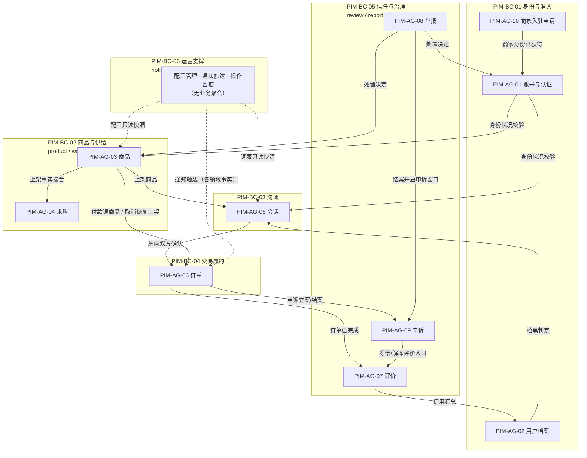

# PIM 限界上下文与聚合

- **模型层级**：PIM（平台无关模型，系统视角；不绑定 NestJS/MySQL 等具体技术，仅与技术方案 §3.1 模块划分做语义对照）
- **版本**：v1.0
- **作者**：mda-engineer
- **日期**：2026-10-06
- **状态**：已发布（CEO 审核通过 2026-02-06）
- **输入来源**：
  - `Modeling/cim/业务领域模型.md` v1.0（CIM-E-01~10）
  - `Modeling/cim/业务流程与规则.md` v1.0（CIM-P-01~05、CIM-R-01~36）
  - `Modeling/ontology/领域本体.md` v1.0（ONT-01~20，语义基准）
  - `docs/design/2026-02-06-技术选型与总体方案.md` v1.2 §3.1（11 模块划分，仅作对照基准，不作为划分依据）
- **转换留痕（CIM→PIM 取舍记录）**：
  1. **BC 按业务语义切、不按操作者角色切**：技术方案 §3.1 的 `admin` 模块按"运营人员"这一角色聚合了治理（举报处置/申诉仲裁/黄牛复核）与支撑（名单/词表配置/账号管理）两类语义不同的职能，本层将其拆开映射到 BC-05 与 BC-06（见 §2 对照表冲突标注 C-1）。PIM 层坚持语义边界，模块层如何归属属 PSM 决策。
  2. **"账号"从 CIM-E-01 用户中析出**：CIM 层有意只保留业务主体"用户"（见 CIM 转换留痕③）；PIM 是系统视角，登录凭证、token、认证材料属系统关切，故拆为"账号与认证聚合"（PIM-AG-01）与"用户档案聚合"（PIM-AG-02）两个聚合，前者管"能不能进来、是什么身份"，后者管"对外呈现什么"。
  3. **消息从会话中切分为聚合内实体**：CIM 层将消息并入会话（留痕④），PIM 按一致性边界把消息/意向卡片作为会话聚合内实体（PIM-AG-05），风险词命中作为值对象留痕，符合"未命中不留痕"（CIM-R-32）的稀疏特征。
  4. **申诉（CIM-E-08）归入信任与治理上下文而非交易履约**：申诉虽可作用于订单，但其生命周期（发起→运营介入→裁决→结案）由治理规则（CIM-R-24/31）驱动、裁决权在运营，与订单的业务不变量（五态流转）不同质；与订单仅以"引用订单号 + 冻结/恢复评价入口"的接口协作，不共享聚合。
  5. **通知不建业务聚合**：通知（F15）无自身业务不变量，是各 BC 领域事件的投递通道，本层仅作为 BC-06 运营支撑的支撑能力声明，事件清单留待后续 PIM 领域事件文件（PIM-EV-xx）承载。
  6. **值对象只建业务语义明确的**：Money/TimeWindow/DeliveryAppointment/PriceRange/Rating 等有业务约束（如金额非负、评价期 7 天）的建值对象；纯展示字符串（昵称、描述）不建模。

---

## 1. 限界上下文划分（PIM-BC-01 ~ PIM-BC-06）

### PIM-BC-01 身份与准入（Identity & Access）

- **职责**：回答"你是谁、能做什么"。负责登录会话建立、三类身份（学生/教职工/商家）认证与资格生命周期（含毕业清仓）、商家入驻资质审核、可认证学校范围维护、账号处置（封禁/只读/注销）与拉黑关系。
- **纳入实体**：CIM-E-01（身份侧面）、CIM-E-09、CIM-E-10。
- **来源功能**：F1、F26、F27、F32、F33、F36、F29（拉黑）。

### PIM-BC-02 商品与供给（Listing & Supply）

- **职责**：回答"有什么可买/可卖"。负责商品发布合规与生命周期（上架/下架/交易中/已售）、搜索浏览收藏、急出曝光额度、求购发布与撮合、品类正面清单的业务读取。
- **纳入实体**：CIM-E-02、CIM-E-03。
- **来源功能**：F5、F6、F7、F8、F9、F10a、F33（亮标读取）。

### PIM-BC-03 沟通（Communication）

- **职责**：回答"买卖双方怎么谈"。负责会话建立边界、消息收发与已读、交易意向卡片双向确认、风险词警示与留痕。
- **纳入实体**：CIM-E-04（含 ONT-07 消息）。
- **来源功能**：F12、F13、F14。

### PIM-BC-04 交易履约（Trade Fulfillment）

- **职责**：回答"这笔买卖走到哪一步"。负责订单创建、支付留痕、五态状态机流转、取消/拒收/超时自动确认、标记已售联动、订单留痕。
- **纳入实体**：CIM-E-05。
- **来源功能**：F34、F35。

### PIM-BC-05 信任与治理（Trust & Governance）

- **职责**：回答"出了事怎么办"。负责交易完成后的互评与延迟公开、举报受理与分级处置、黄牛/违规风控复核、申诉（纠纷类与被处置类）受理与裁决、举报人匿名保护。
- **纳入实体**：CIM-E-06、CIM-E-07、CIM-E-08。
- **来源功能**：F17、F18、F20、F21、F22（复核侧）、F23、F30、F31。

### PIM-BC-06 运营支撑（Operations Support）

- **职责**：回答"平台怎么运转"。负责词表/品类清单等配置的管理与分发、站内通知与订阅消息触达、运营账号与操作留痕、高校名单与处置规则的运营维护入口。
- **纳入实体**：无独立 CIM 业务实体（支撑 CIM-E-10 的维护动作与各 BC 的通知触达）。
- **来源功能**：F15、F36（配置侧）、§8.1-8.5、N6/N9（调阅留痕）。

---

## 2. 与技术方案 §3.1 十一模块对照表

| PIM 限界上下文 | 对应模块（§3.1） | 对照性质 |
|---|---|---|
| PIM-BC-01 身份与准入 | auth、user | auth 全覆盖；user 的主页/资料属身份呈现，语义对齐 ✅ |
| PIM-BC-02 商品与供给 | product、wantbuy、config（品类清单读侧） | ✅（config 为只读依赖，见冲突 C-2） |
| PIM-BC-03 沟通 | chat | 一一对应 ✅ |
| PIM-BC-04 交易履约 | order | 一一对应 ✅ |
| PIM-BC-05 信任与治理 | review、report、admin（举报处置/申诉仲裁/黄牛复核/风控复核部分） | ⚠️ admin 一对二，见冲突 C-1 |
| PIM-BC-06 运营支撑 | notify、config、admin（名单/词表配置/账号管理部分） | ⚠️ 同上，见冲突 C-1/C-3 |

**冲突与不一致标注（如实上报，不裁决）**：

- **C-1（一对多，需裁决）**：§3.1 `admin` 模块按"运营角色"聚合了语义上属于两个 BC 的职能——治理裁决（F20/F21/F23/F31，属 BC-05）与配置与账号管理（F36 配置侧/词表/账号管理，属 BC-06）。PIM 层按 DDD 语义边界拆分；模块层是否拆分为 `admin-governance` / `admin-support` 两模块属技术决策，超出本角色边界，**上报 CEO/架构师裁决**。在裁决前，PSM 映射时将以"admin 模块内两个子边界"的方式表达。
- **C-2（横切共享，已留痕不裁决）**：`config` 模块同时被 BC-02（品类正面清单，F5）与 BC-05（违规词表/风险词表，F13/F22）只读依赖，属横切配置服务。PIM 立场：配置的**管理**归 BC-06，配置的**业务消费**以各 BC 本地只读快照表达（与 §3.1 解耦纪律"宁可复制不可共享"方向一致），不出现跨 BC 的共享业务对象。
- **C-3（横切，同 C-2 处理）**：`notify` 无自身业务不变量，服务全部 BC；PIM 不为其建聚合，仅在 BC-06 声明其支撑能力。
- **C-4（归属歧义，需确认）**：CIM-E-09 商家入驻申请在 §3.1 中仅见 admin 模块承担 F32（审核侧），**用户侧提交入口（材料提交、补正再申请）在十一模块中未明确归属**（候选：auth 或 admin）。PIM 按语义将其聚合（PIM-AG-10）置于 BC-01 身份与准入；模块归属请架构师确认后落入 PSM。
- **C-5（表述差异，无冲突）**：§3.1 `report` 模块名为"举报申诉"，承担 F18/F30/F31 **用户侧提交**；处置与仲裁在 admin。PIM 将举报与申诉两个聚合均置于 BC-05，"提交—处置"是同一聚合生命周期内的两个阶段，不构成 BC 分裂，但与 C-1 的模块切分叠加后，PSM 需显式表达"report 模块写、admin 模块改状态"的跨模块状态推进，**禁止跨模块直查直改**（§3.1 纪律），应通过契约事件/接口完成。

---

## 3. 聚合清单与详述（PIM-AG-01 ~ PIM-AG-10）

> 聚合编号连续；接口声明用业务语言（"提供/接收/发布"），不含 HTTP/REST/表名。不变量引用 CIM-R 编号。

### PIM-AG-01 账号与认证聚合（BC-01）

- **聚合根**：Account（账号）
- **实体**：IdentityVerification（身份认证记录，学生/教职工通道）
- **值对象**：Role（学生/教职工/商家/游客）、AccountStatus（正常/封禁/只读/清仓中/已注销）、ClearancePeriod（清仓期，含起算点）
- **聚合内不变量**：
  - 未通过认证前 Role 恒为游客，任何受限能力判定以本聚合读模型为准（CIM-R-01）。
  - 学生认证有效校范围必须属于高校名单读模型快照（CIM-R-02）；教职工沿用学生规则且永不进入毕业处置（CIM-R-03）。
  - 清仓期固定 30 天自到期通知起算；存在在途交易时延后处置上限另计 30 天，两期独立（CIM-R-35）。
  - 账号"已注销"为终态，不可逆；注销不删除历史业务记录（CIM-R-34）。
- **对外接口声明**：提供"校验当前操作者身份与账号状况"；提供"提交身份认证材料"；发布"身份已获得 / 资格到期进入清仓 / 账号被处置"等资格变化事实；接收治理上下文的"处置决定"以变更账号状况。

### PIM-AG-02 用户档案聚合（BC-01）

- **聚合根**：UserProfile（用户档案/公开主页）
- **实体**：BlockRelation（拉黑关系）
- **值对象**：PublicProfile（昵称/头像/简介/身份标识）、CreditSummary（信用评分汇总，来自评价读模型）
- **聚合内不变量**：
  - 实名材料（学号、资质文件）不出现在 PublicProfile（N6，回指 CIM-R-20 同口径）。
  - 拉黑关系为单向边；被拉黑方向拉黑方发起的会话建立请求一律拒绝（CIM-R-04）。
  - 商家档案的"认证商家"标识不可关闭（CIM-R-28）。
- **对外接口声明**：提供"查询公开主页"；提供"编辑本人资料（经违规词校验）"；提供"建立/解除拉黑"；提供"某用户是否被某用户拉黑"的判定。

### PIM-AG-03 商品聚合（BC-02）

- **聚合根**：Product（商品）
- **实体**：Favorite（收藏，聚合内弱实体，随商品存在）
- **值对象**：Money（金额，非负）、CategoryLeaf（品类正面清单叶子）、Condition（规范成色枚举）、MeetupOption（自提地点与可约时间）、TradeModeIntent（交易方式意向）、UrgentBadge（急出标记）
- **聚合内不变量**：
  - 状态四值：上架/下架/交易中/已售；"已售"不可逆且必须记录指定买家（CIM-R-13）；"交易中"仅可由线上支付付款成功进入（CIM-R-11）。
  - 发布必须具备实拍图与规范成色，缺失不得上架（CIM-R-06）；品类必须命中正面清单叶子（CIM-R-07）。
  - 同账号同时生效急出标记 ≤3 件；售出或下架即释放额度；商家商品不得持有急出加权（CIM-R-09）。
  - 取消成功事实到达后，"交易中"自动回到"上架"（CIM-R-17）。
- **对外接口声明**：提供"发布/编辑/上下架商品（经合规校验）"；提供"按检索条件返回在售商品读模型"；提供"将商品标记已售并指定买家"；发布"商品上架 / 已售 / 恢复上架"等供给变化事实；接收交易履约上下文的"付款成功 / 取消成立"事实以驱动状态。

### PIM-AG-04 求购聚合（BC-02）

- **聚合根**：WantBuy（求购）
- **实体**：无（撮合匹配为读模型投影，非聚合内实体）
- **值对象**：PriceRange（预期价位区间）、ConditionRequirement（成色要求）、ValidityPeriod（有效期，含第 27 天提醒点）
- **聚合内不变量**：
  - 默认有效期 30 天，续期每次 +30 天不限次（CIM-R-33）。
  - 终态（到期失效/手动关闭/已买到）一旦到达，停止一切撮合通知，不可复活（CIM-R-33）。
- **对外接口声明**：提供"发布/续期/关闭/标记已买到求购"；接收商品上下文的"商品上架"事实做匹配，发布"撮合命中"事实（供通知触达）。

### PIM-AG-05 会话聚合（BC-03）

- **聚合根**：Conversation（会话）
- **实体**：Message（消息）、TradeIntentCard（交易意向卡片）
- **值对象**：RiskWordHit（风险词命中留痕：命中词、时间；发送人/接收人/原文随消息实体）、ReadCursor（双方已读位置）
- **聚合内不变量**：
  - 会话建立前提：发起方已认证、关联商品处于"上架"或"交易中"、双方无拉黑阻断（CIM-R-01、CIM-R-04）。
  - 意向卡片以"最后一条双方均确认"为有效记录；无确认记录时回退发布时意向声明（CIM-R-14）。
  - 命中风险词的消息可发送但必留痕五字段；未命中不留痕（CIM-R-32）。
  - 会话内容自产生起留存不少于 90 天（CIM-R-34）。
- **对外接口声明**：提供"围绕商品发起会话"；提供"发送消息/意向卡片"；提供"确认意向卡片"；发布"意向已双方确认"事实（供交易履约创建订单）；发布"风险词命中"事实（供治理调阅）。

### PIM-AG-06 订单聚合（BC-04）

- **聚合根**：Order（订单）
- **实体**：OrderEvent（订单状态流转留痕）、PaymentRecord（支付记录）
- **值对象**：Money（成交金额）、DeliveryAppointment（约定交货时间与地点）、TradeMode（当面自提/线上支付）、CancelRequest（取消请求，含 24h 响应窗口）
- **聚合内不变量**：
  - 状态机严格五态：待交货/待确认/已完成/已取消/申诉中；"已完成""已取消"为终态，"已完成"不可逆（CIM-R-18）。
  - 线上支付订单创建前必须记录买家已确认风险明示三要素（CIM-R-10）；付款成功同时触发关联商品锁定（CIM-R-11）。
  - 约定交货时间后 48h 未确认且无异议自动转已完成；无约定时间以付款成功 +48h 起算（CIM-R-12）。
  - 取消仅允许于确认收货前；对方 24h 未响应视为默认同意；拒绝则回到原状态并留痕（CIM-R-15）；拒收必须现场发起并留痕（CIM-R-19）。
  - 取消成立即记录原路退款指令，平台不留存资金（CIM-R-16）。
  - 申诉中状态冻结评价入口，结案后回到原流转（CIM-R-30/31）。
- **对外接口声明**：提供"基于已确认意向创建订单"；提供"录入支付结果 / 确认收货 / 发起取消或拒收 / 响应取消"；发布"订单已进入某状态 / 已自动确认 / 已取消成立（附退款指令与商品恢复指令）"等履约事实；接收治理上下文的"申诉立案/结案"以进出"申诉中"。

### PIM-AG-07 评价聚合（BC-05）

- **聚合根**：Review（评价）
- **实体**：无（双方两条评价为同聚合两个实例，以订单号为关联键）
- **值对象**：Rating（星级）、ReviewWindow（7 天互评期）、VisibilityState（待公开/已公开）
- **聚合内不变量**：
  - 仅"已完成"订单的买卖双方可提交，窗口期 7 天；逾期未评方按默认好评计入（CIM-R-29）。
  - 延迟公开：双方均提交或窗口届满前，任何单方评价不可见（CIM-R-30）。
  - 关联订单处于"申诉中"时评价入口冻结（CIM-R-30）。
- **对外接口声明**：提供"提交评价"；发布"评价已公开"事实（供用户档案更新信用汇总）；提供"某用户公开评价读模型"。

### PIM-AG-08 举报聚合（BC-05）

- **聚合根**：Report（举报）
- **实体**：ReportEvidence（举报附件：说明与截图）
- **值对象**：ReportType（诈骗/违禁品/虚假描述/其他）、SlaDeadline（分级时限：4h/24h/48h）、DisposalResult（下架/警告/封禁/驳回）
- **聚合内不变量**：
  - 举报人身份在任何对被举报方可见的投影中不存在（泄露点数 0，CIM-R-20）。
  - 处理时限按类型分级，超时仅标记告警不改变状态（CIM-R-21）。
  - 处理结果仅限四枚举，结案必须通知举报人（CIM-R-22）。
  - 被举报对象为商家且违禁品类成立时，处置必须三件套齐备（下架+撤销资质+禁入驻），不得拆分执行（CIM-R-23）。
- **对外接口声明**：提供"提交举报（匿名）"；提供"处置举报并记录结果"；发布"处置决定"事实（供身份/商品上下文执行状态变更）；发布"处置已结案"事实（触发 7 天申诉窗口）。

### PIM-AG-09 申诉聚合（BC-05）

- **聚合根**：Appeal（申诉）
- **实体**：AppealEvidence（证据材料：聊天记录引用/付款凭证/约定信息）
- **值对象**：AppealType（卖家失联/错标已售/货不对板/误封复核等）、AppealWindow（7 天申诉窗口）、Verdict（裁决结论）
- **聚合内不变量**：
  - 被处置类申诉仅可在处置通知后 7 天内发起，逾期入口关闭（CIM-R-24）。
  - 纠纷类申诉立案必须使关联订单进入"申诉中"（CIM-R-31 衔接 CIM-R-18）。
  - 运营介入时限 48h；裁决结论必达双方（CIM-R-31）。
- **对外接口声明**：提供"发起申诉（附证据）"；提供"裁决并结案"；发布"申诉立案/结案"事实（供交易履约进出申诉中、供评价聚合解冻）。

### PIM-AG-10 商家入驻申请聚合（BC-01）

- **聚合根**：MerchantApplication（商家入驻申请）
- **实体**：QualificationMaterial（资质材料：营业执照/校园门店证明）
- **值对象**：ReviewProgress（待审核/审核中/通过/驳回）、RejectionReason（驳回理由枚举，§8.5）、SlaClock（2 个工作日计时，跳节假日）、CoolingPeriod（7 天冷却）
- **聚合内不变量**：
  - SLA 自材料完整提交起算 2 个工作日，跳过周末与法定节假日；补正后计时重置；超时仅标记（CIM-R-25）。
  - 驳回必须携带枚举内具体理由，空理由不成立（CIM-R-26）。
  - 驳回后 7 天冷却期内不得重新提交；补正再申请不限次（CIM-R-27）。
  - 造假/违禁类驳回联动禁入驻名单，再次申请一律拦截（CIM-R-23）。
- **对外接口声明**：提供"提交/补正入驻申请"；提供"审核通过与驳回"；发布"商家身份已获得"事实（供账号与认证聚合变更角色）；发布"驳回已结案"事实（开启 7 天申诉窗口）。

---

## 4. 上下文划分图

> 注：箭头为"业务事实/判定"流向，非技术调用；跨上下文协作一律通过对外接口声明与领域事实完成，不共享聚合内部结构（与 §3.1 解耦纪律同向）。

## 5. 下游指引

- 订单五态与商品四态的状态机形式化（PIM-SM-xx）、跨上下文领域事件清单（PIM-EV-xx）在后续 PIM 文件展开，事件名以本文件"对外接口声明"中的"发布……事实"为准。
- PSM 映射时，模块归属以 §2 对照表为准，冲突 C-1/C-4 待裁决后方可定稿 admin 相关映射。
