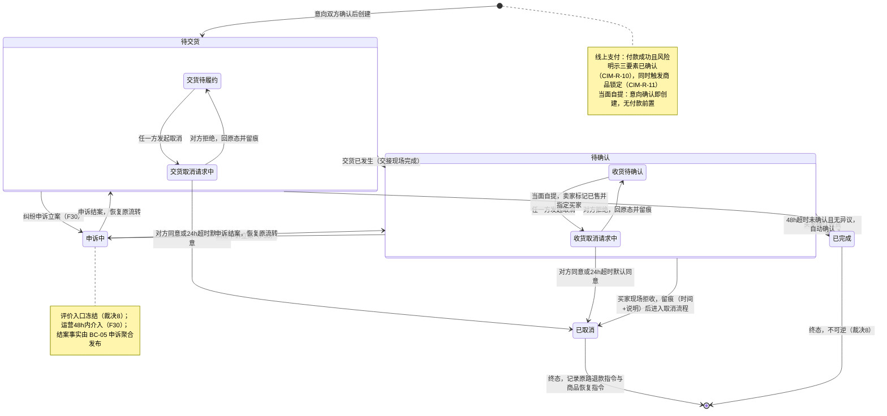
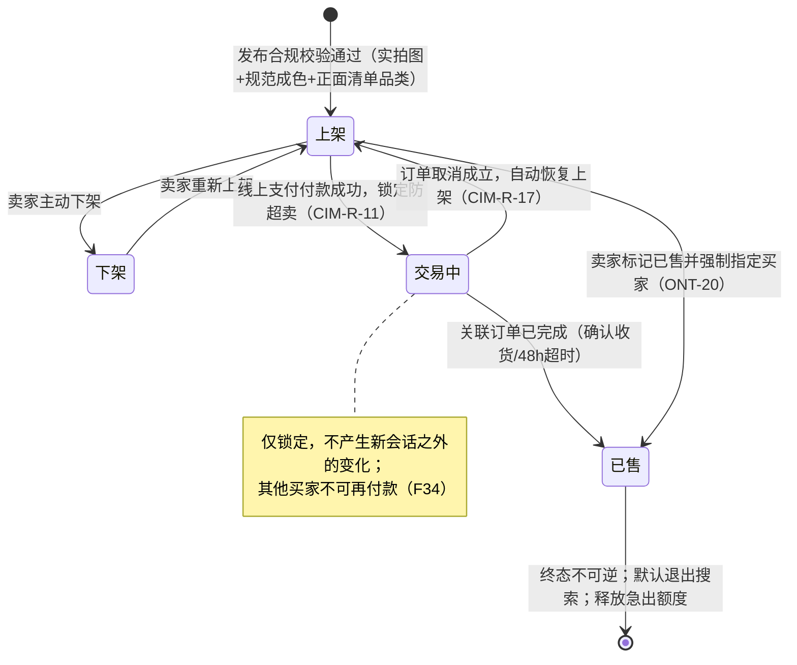
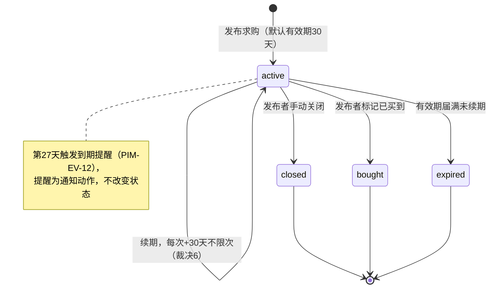
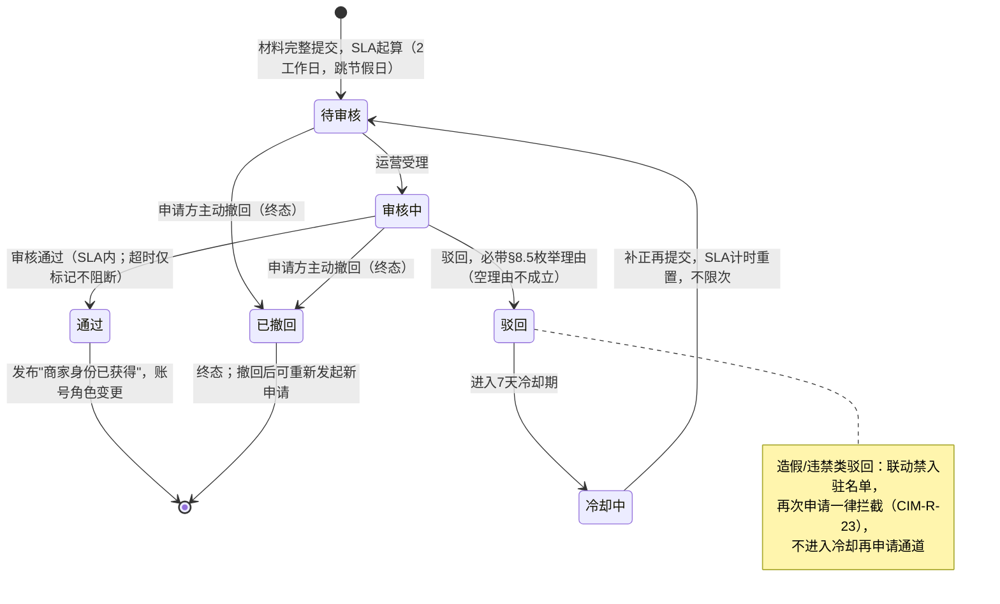
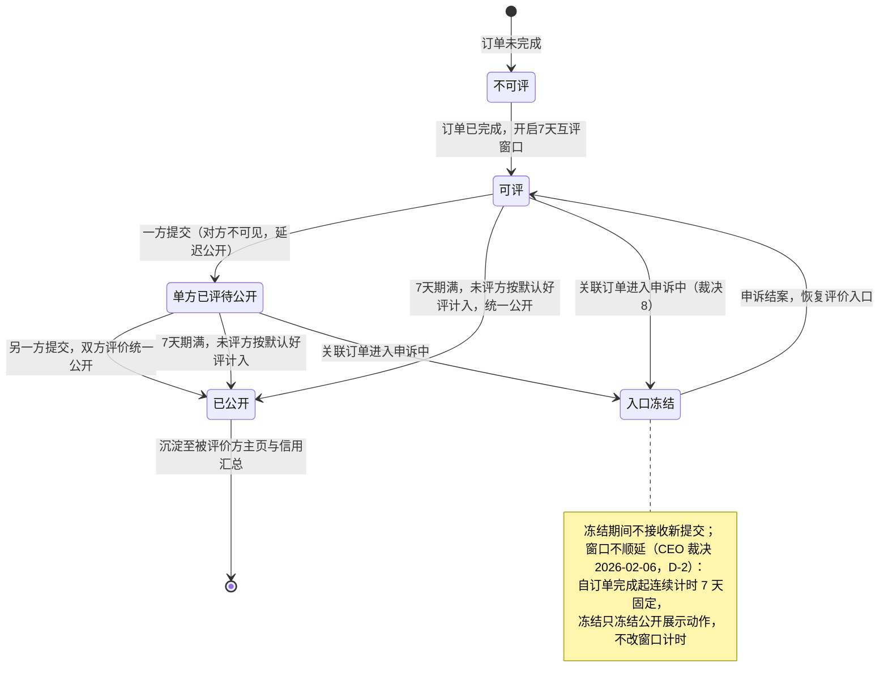

# PIM 领域事件与状态机

- **模型层级**：PIM（平台无关模型，系统视角；状态与事件用业务语言，不含定时器实现、消息中间件等技术概念）
- **版本**：v1.0
- **作者**：mda-engineer
- **日期**：2026-10-06
- **状态**：已发布（CEO 审核通过 2026-02-06）
- **输入来源**：
  - `Modeling/pim/限界上下文与聚合.md` v1.0（PIM-BC-01~06、PIM-AG-01~10，事件名以其"对外接口声明·发布……事实"为准）
  - `Modeling/ontology/领域本体.md` v1.0（ONT-01~20、§5 口径常量索引，语义基准）
  - `docs/prd/2026-02-06-校园二手平台完整PRD.md` v1.0（冻结）：F34/F35（订单）、F7/F34（商品）、F9+裁决6（求购）、F32+裁决9（商家入驻）、F17+裁决8（评价）、§10.4 裁决 1~10
- **转换留痕（BC/聚合与 PRD 规则 → 状态机/事件的取舍记录）**：
  1. **取消请求建模为态内子状态而非独立第六态**：PRD 裁决 3 明确"取消被拒后订单回到原状态（待交货/待确认）"，说明取消请求期间订单**主状态不变**；故将"取消请求中"建模为待交货/待确认的内部子状态，五态枚举保持与 F34 AC3 逐字一致，不新增状态。
  2. **超时自动确认与手动确认收货合并为同一目标迁移**：两者业务效果完全等同（→已完成、不可逆），在迁移标签上以"确认收货 / 48h 超时自动确认"并列表达，起算规则（约定时间后 48h；未录入时付款成功 +48h，裁决 4）以守卫条件注记。
  3. **求购"到期前 3 天提醒"不建模为状态**：提醒是纯通知动作，不改变求购任何业务属性；建模为领域事件 PIM-EV-12 而非状态迁移，状态机只保留 active/closed/bought/expired 四态（与 ONT-02 一致）。
  4. **评价"默认好评"不建独立状态**：默认好评是"窗口届满时对未评方的补全规则"，产出仍是公开的评价记录；故作为迁移标签（期满 → 已公开，未评方按默认好评计入），不单列状态。
  5. **申诉中冻结评价入口建模为评价状态机的"入口冻结"态**：裁决 8 要求订单申诉中冻结评价入口、结案后恢复；该冻结属评价生命周期事实，故在 PIM-SM-05 内表达，订单状态机仅以"申诉中"态承载。
  6. **事件粒度按"业务事实"切、不按"技术通知"切**：同一事实只发一个事件（如"订单已完成"覆盖确认收货/超时/标记已售三条路径，以载荷中的完成原因区分），避免订阅方重复消费。
  7. **上下文映射只允许两种集成方式**（承 C-2/C-5 与 §3.1 解耦纪律）：① 领域事件（异步事实）；② contract 声明（同步只读接口，开放主机服务+发布语言）。共享内核仅限 contract 内的枚举/常量声明（如五态枚举、处置结果枚举），**禁止共享业务对象、禁止跨 BC 直查直改**。

---

## 1. 核心状态机（PIM-SM-01 ~ PIM-SM-05）

### PIM-SM-01 订单状态机（PIM-AG-06，BC-04）

- **状态集**：待交货 / 待确认 / 已完成 / 已取消 / 申诉中（F34 AC3 五态枚举，无其他状态）。
- **终态**：已完成（不可逆，裁决 8）、已取消。
- **关键守卫**：取消/拒收仅限确认收货前（F35）；超时确认起算=约定交货时间后 48h，未录入约定时间时以付款成功 +48h 起算（裁决 4）；取消 24h 自发起时刻起算、买卖双向同规则（裁决 3）；申诉中冻结评价入口（裁决 8）。

> **CEO 裁决（2026-02-06，PIM-D-1）**：F30 申诉类型含"错标已售"，其对象多为已完成订单；裁决确认——已完成订单的申诉**不进入"申诉中"状态**，仅走运营裁决与信用处置留痕，"已完成不可逆"（裁决 8）保持成立。即"申诉中"仅从未终态订单（待交货/待确认）进入，本图维持不变。

### PIM-SM-02 商品状态机（PIM-AG-03，BC-02）

- **状态集**：上架 / 下架 / 交易中（锁定） / 已售（ONT-01 四态）。
- **终态**：已售（不可逆，必须记录指定买家，CIM-R-13；默认退出搜索结果，详情页保留"已售出"标识）。

### PIM-SM-03 求购状态机（PIM-AG-04，BC-02）

- **状态集**：active / closed / bought / expired（ONT-02）。
- **终态**：closed / bought / expired，到达后停止一切撮合通知、不可复活（CIM-R-33）。

### PIM-SM-04 商家入驻申请状态机（PIM-AG-10，BC-01）

- **状态集**：待审核 / 审核中 / 通过 / 驳回 / 已撤回（F32、U6；已撤回终态为 2026-02-06 CEO 裁决 PSM-INC-03 新增）。
- **SLA**：2 个工作日，自材料完整提交起算、跳过周末与法定节假日、补正后计时重置、超时仅标记（裁决 9，CIM-R-25）。
- **终态**：通过（联动账号角色变更）；已撤回（申请方主动撤回，PSM-INC-03 裁决）；驳回后 7 天冷却、补正再申请不限次（CIM-R-27）。
- **PSM 下沉口径（PSM-INC-03 裁决）**：库表枚举含 cancelled；「审核中」不单列枚举，受理留痕由运营操作日志承载。

### PIM-SM-05 评价生命周期状态机（PIM-AG-07，BC-05）

- **状态集**：不可评 / 可评 / 单方已评待公开 / 入口冻结 / 已公开。
- **规则**：仅已完成订单买卖双方可评，窗口 7 天；逾期未评方按默认好评计入；延迟公开——双方均提交或窗口届满前单方评价不可见（CIM-R-29/30）；订单申诉中评价入口冻结、结案后恢复（裁决 8）。

---

## 2. 领域事件清单（PIM-EV-01 ~ PIM-EV-15）

> 事件名=业务事实（过去式）；载荷用业务语言；订阅方只声明"哪个 BC 关心、用于什么"，不规定技术通道。所有跨 BC 订阅均通过 contract 声明的事件契约完成（见 §3）。

| 编号 | 事件 | 触发源（聚合/状态机迁移） | 载荷（业务语言） | 订阅方（BC / 用途） |
|---|---|---|---|---|
| PIM-EV-01 | 订单已创建 | PIM-AG-06 / SM-01 `[*]→待交货` | 订单号、买卖双方、商品快照、交易方式、金额、约定交货时间与地点 | BC-06：订单状态变更通知双方；BC-02：读侧成交热度统计（可选投影） |
| PIM-EV-02 | 买家已付款（线上支付付款成功） | PIM-AG-06 / 支付记录录入 | 订单号、金额、付款时间、支付流水号、风险明示三要素确认留痕 | BC-02 商品：锁定为"交易中"（防超卖）；BC-06：通知卖家备货交货 |
| PIM-EV-03 | 订单已交货（进入待确认） | SM-01 `待交货→待确认` | 订单号、交货时间、48h 确认截止时刻 | BC-06：提醒买家验货确认；BC-06：超时确认倒计时驱动 |
| PIM-EV-04 | 订单已完成 | SM-01 `→已完成`（含确认收货/48h 超时/标记已售） | 订单号、完成原因（确认收货/超时自动/标记已售）、完成时间 | BC-05 评价：开启 7 天互评窗口；BC-02 商品：转"已售"（线上支付路径）；BC-06：评价提醒通知 |
| PIM-EV-05 | 订单已取消 | SM-01 `→已取消`（含对方同意/24h 默认同意/现场拒收） | 订单号、取消发起方、成立方式、留痕（拒收含时间+说明）、原路退款指令、商品恢复指令 | BC-02 商品：自动恢复上架；BC-06：通知双方取消结果与退款说明 |
| PIM-EV-06 | 申诉已立案 | PIM-AG-09（BC-05） | 申诉号、类型、关联订单号、申诉人、证据摘要 | BC-04 订单：转入"申诉中"；BC-05 评价：冻结评价入口；BC-06：通知被申诉方 |
| PIM-EV-07 | 申诉已结案 | PIM-AG-09（BC-05） | 申诉号、裁决结论、关联订单号、恢复原状态指示 | BC-04 订单：恢复原流转；BC-05 评价：解冻评价入口；BC-06：裁决结论必达双方 |
| PIM-EV-08 | 商品已上架 | PIM-AG-03 / SM-02 `→上架` | 商品号、卖家、品类叶子、价位、成色、交易方式意向 | BC-02 求购：撮合匹配扫描；BC-06：收藏该卖家/相似求购的触达（如启用） |
| PIM-EV-09 | 商品已售出（标记已售） | PIM-AG-03 / SM-02 `→已售` | 商品号、指定买家、售出时间 | BC-04：当面自提路径订单转已完成的事实源；BC-05 评价：被指定买家获得评价入口；BC-06：退出搜索的读侧刷新 |
| PIM-EV-10 | 商品已恢复上架 | PIM-AG-03 / SM-02 `交易中→上架` | 商品号、恢复原因（订单取消成立）、关联订单号 | BC-02 求购：重新纳入撮合；BC-06：收藏者可见性恢复 |
| PIM-EV-11 | 求购撮合命中 | PIM-AG-04（接收 EV-08 后匹配） | 求购号、命中商品号、匹配要素（品类/价位/成色） | BC-06：向求购发布者推送撮合通知（F9/F15） |
| PIM-EV-12 | 求购到期提醒 | PIM-AG-04 有效期第 27 天 | 求购号、剩余天数（3 天）、续期入口 | BC-06：到期提醒通知（F9/F15） |
| PIM-EV-13 | 举报已提交 | PIM-AG-08（BC-05） | 举报号、类型（诈骗/违禁品/虚假描述/其他）、被举报对象、分级 SLA 时限（举报人身份不出现） | BC-06：进运营处理队列并告警（4h/24h/48h 分级）；BC-06：提交回执通知举报人 |
| PIM-EV-14 | 处置已完成（举报结案） | PIM-AG-08（BC-05） | 举报号、处置结果（下架/警告/封禁/驳回）、被处置对象 | BC-01 账号：执行封禁/只读等处置；BC-02 商品：执行下架；BC-05 申诉：开启被处置方 7 天申诉窗口；BC-06：结果通知举报人 |
| PIM-EV-15 | 评价已公开 | PIM-AG-07 / SM-05 `→已公开` | 订单号、评价双方、星级、公开时间 | BC-01 用户档案：更新信用汇总读模型；BC-06：通知被评价方 |

> **事件命名与 BC/聚合文件的追溯**：EV-01~05、EV-08~10 分别对应 PIM-AG-06/AG-03"发布……事实"的接口声明；EV-06/07 对应 PIM-AG-09；EV-11/12 对应 PIM-AG-04；EV-13/14 对应 PIM-AG-08；EV-15 对应 PIM-AG-07。事件消费侧的"跨模块状态推进"（如 report 写、admin 改状态，冲突 C-5）一律以事件契约为唯一通道。

---

## 3. 上下文映射（Context Mapping）

### 3.1 集成关系总表

| 上游（供给方） | 下游（消费方） | 集成内容 | 关系模式（DDD 术语） | 集成方式 |
|---|---|---|---|---|
| PIM-BC-01 身份与准入 | BC-02/03/04/05（全体） | 身份状况校验（能否发布/会话/交易）、拉黑判定 | **开放主机服务 + 发布语言（OHS/PL）**；下游对身份枚举为**遵奉者（Conformist）** | contract 声明（同步只读判定接口） |
| PIM-BC-03 沟通 | PIM-BC-04 交易履约 | "意向已双方确认"事实 → 创建订单 | **客户-供应商（Customer-Supplier）**：BC-03 按 BC-04 的创建契约供给 | 事件 + contract 声明 |
| PIM-BC-04 交易履约 | PIM-BC-02 商品与供给 | 付款锁定 / 取消恢复 / 完成转已售 | **客户-供应商**；BC-02 侧以**防腐层（ACL）**将订单事实翻译为商品自身状态迁移，不引入订单概念 | 事件（EV-02/04/05） |
| PIM-BC-04 交易履约 | PIM-BC-05 信任与治理 | "订单已完成"事实 → 开启评价窗口 | **客户-供应商**；评价窗口规则自治于 BC-05 | 事件（EV-04） |
| PIM-BC-05 信任与治理 | PIM-BC-04 交易履约 | 申诉立案/结案 → 进出"申诉中" | **共享内核仅限 contract 声明**：五态枚举（含"申诉中"）为双方共享的契约常量；行为侧为**客户-供应商**（BC-04 必须响应立案/结案事实） | 事件（EV-06/07）+ 共享枚举声明 |
| PIM-BC-05 信任与治理 | PIM-BC-01 身份与准入 | 处置决定 → 账号封禁/只读；商家身份已获得 → 角色变更 | **客户-供应商**；处置结果四枚举为 contract 共享声明（同上行模式） | 事件（EV-14、PIM-AG-10 事实） |
| PIM-BC-05 信任与治理 | PIM-BC-02 商品与供给 | 处置决定 → 商品下架 | **客户-供应商**；BC-02 以 ACL 翻译为"下架"动作 | 事件（EV-14） |
| PIM-BC-05 信任与治理 | PIM-BC-01 身份与准入（档案） | "评价已公开" → 信用汇总 | **客户-供应商**；信用汇总为 BC-01 本地读模型投影 | 事件（EV-15） |
| PIM-BC-02 商品与供给（内部） | —（AG-03→AG-04 撮合） | 商品上架 → 求购匹配 | BC 内部协作，**非上下文映射**；经 EV-08/EV-11 解耦 | 事件（BC 内） |
| PIM-BC-06 运营支撑 | 全体 BC | 品类正面清单/词表只读快照；各领域事实的通知触达 | **开放主机服务 + 发布语言（OHS/PL）**；配置消费为各 BC **本地只读快照**（承冲突 C-2，宁可复制不可共享） | contract 声明（快照）+ 订阅全体事件做触达 |

### 3.2 "无共享业务模块"约束下的集成纪律（与 §3.1 同向，作为 PSM 硬性约束下沉）

1. **跨 BC 协作只有两条通道**：① 领域事件（§2 清单为唯一事件目录，新增事件须走变更流程并回填本文件）；② contract 声明（OHS/PL 的只读契约，如身份校验、配置快照）。除此之外不存在第三种集成方式。
2. **共享内核（Shared Kernel）被显式禁用**，唯一例外是 contract 内的**枚举/常量声明**（订单五态、处置结果四枚举、举报类型、驳回理由枚举等纯值集合），且这些声明的权威定义在本体/PRD，contract 只做引用。
3. **禁止跨 BC 直查直改**：任何"读他方数据"以 contract 只读接口或事件投影的本地读模型实现；任何"改他方状态"以事件+对端聚合自治完成（典型如 C-5：report 提交、admin 推进状态，经 EV-13/EV-14 衔接）。
4. **防腐层（ACL）责任在下游**：消费方把上游事实翻译成本上下文语言（如订单事实→商品状态迁移），上游不为下游定制模型。

---

## 4. 待澄清与不一致问题（如实上报，不裁决）

- **D-1（已裁决，2026-02-06 CEO）**：F30"错标已售"申诉对象多为已完成订单，与裁决 8"已完成不可逆"的张力已定案——已完成订单的申诉不进入"申诉中"状态，仅走运营裁决与信用处置留痕，已完成不可逆保持成立（见 PIM-SM-01 注）。
- **D-2（已裁决，2026-02-06 CEO）**：评价窗口不顺延——自订单完成起连续计时 7 天固定；申诉冻结只冻结公开展示动作，不改窗口计时（见 PIM-SM-05 注）。
- **D-3（承前文件，未关闭）**：BC/聚合文件的冲突 C-1（admin 模块一对二）、C-4（商家入驻用户侧入口归属）仍待 CEO/架构师裁决；本文件 EV-13/EV-14 的事件通道设计在两种裁决下均成立，不受影响。

## 5. 下游指引

- PSM 映射时：状态机 → `order`/`product`/`wantbuy`/`auth`/`review` 模块的状态字段与迁移守卫（禁止绕过状态机直写字段，§3.1 纪律）；事件 → 模块间异步契约（事件目录以 §2 为唯一清单）；contract 声明 → §5 API 契约中的只读接口。
- 任何 PRD 口径变更（24h/48h/7 天/30 天/2 工作日）须同步修改本文件对应状态机守卫与本体 §5 常量索引，并标注影响面。
