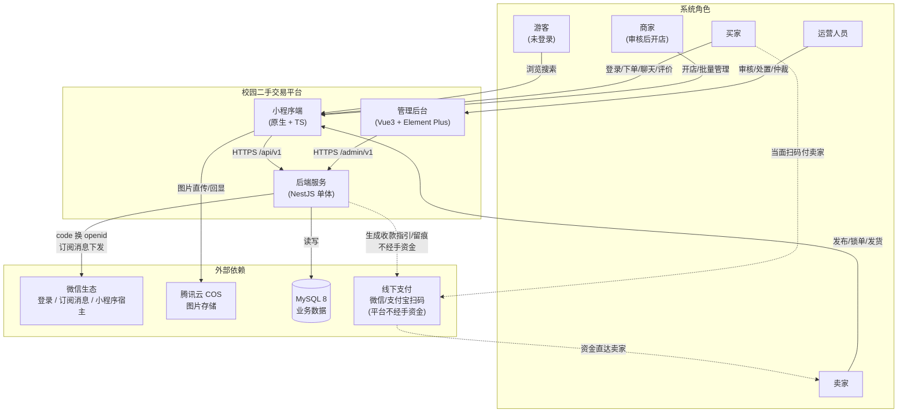
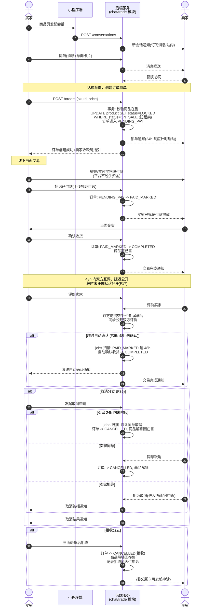

# 校园二手交易平台 —— 架构设计图

- **版本**：v1.1
- **作者**：architect
- **日期**：2026-02-06
- **状态**：已评审 —— 方案 B（模块化单体）已经用户拍板；v1.1 按用户三条强制原则修订（模块边界必须清晰/解耦大于复用/避免共享模块）
- **关联文档**：《2026-02-06-技术选型与总体方案.md》（§3.1 模块划分）、《2026-02-06-校园二手平台完整PRD.md》（订单五态、双模式交易、F35 取消/超时规则）

> 本文档以三张 Mermaid 图固化方案 B 的架构边界：① 系统上下文；② 单体内部组件与模块纪律；③ 核心交易链路时序。所有图仅作方案层表达，不构成实现代码。

---

## 1. 系统上下文图

**说明（关键决策点）：**
1. **平台不经手资金**（方案 B 口径）：支付走线下微信/支付宝扫码，系统只做付款留痕与状态流转，规避资金牌照风险，也省去接入微信支付商户号。
2. **两套入口、一个后端**：小程序端走 `/api/v1`，后台走 `/admin/v1`，鉴权中间件独立，符合 §3.3 页面-模块对照约定。
3. **图片走 COS 直传**：后端只签发上传凭证与存 URL，图片流量不经过单体服务，降低带宽与存储压力。
4. **外部依赖收敛为四类**：微信生态、COS、MySQL、线下支付；无短信、无地图等额外依赖，保证校园项目可维护性。
5. **商家是卖家的特化角色**：复用卖家链路，仅叠加 admin 审核状态，不单独建流程。

---

## 2. 推荐方案 B 组件架构图（模块化单体）

```mermaid
flowchart TB
    subgraph Container["单容器部署边界（Docker Compose：app + mysql + nginx）"]
        subgraph App["NestJS 单体进程"]
            subgraph Contract["contract 层（仅声明：类型/枚举/错误码，无逻辑）"]
                CT["DTO / 枚举 / 错误码常量<br/>订单五态·商品三态·举报四结果<br/>禁止含任何逻辑函数"]
            end

            GW["Controller 网关层<br/>/api/v1（用户端） · /admin/v1（后台）<br/>JWT 鉴权 · 参数校验 · 统一异常过滤"]

            subgraph Modules["业务模块（§3.1，11 个）"]
                AuthM["auth 认证"]
                UserM["user 用户"]
                ProdM["product 商品"]
                WantM["wantbuy 求购"]
                ChatM["chat 聊天"]
                TradeM["trade/order 交易"]
                RevM["review 评价"]
                RepM["report 举报申诉"]
                AdmM["admin 后台"]
                CfgM["config 配置"]
                NtfM["notify 通知"]
            end

            Jobs["jobs 定时任务<br/>求购到期 · 48h 超时确认 · 评价期 · 毕业处置"]

            subgraph DataLayer["数据访问层（Prisma，模块自含 repository）"]
                DAO["每个模块自带 repository/service/validator<br/>仅可访问本 schema 的表<br/>禁止 import 其他模块任何文件"]
            end

            Infra["infra 基础设施（纯技术设施）<br/>数据库连接 · 日志 · 鉴权中间件"]
        end

        subgraph Schemas["MySQL 8（分 schema 隔离）"]
            S1[("auth schema<br/>user/identity/school")]
            S2[("product schema<br/>商品/求购/收藏/品类")]
            S3[("trade schema<br/>订单/评价/举报/申诉")]
            S4[("chat schema<br/>会话/消息/意向卡片")]
        end
    end

    GW --> Modules
    Modules --> CT
    Modules --> DAO
    Modules --> Infra
    NoShare["⚠ 无共享业务模块（用户三条强制原则）<br/>模块间只允许依赖 contract 声明与 infra 基础设施<br/>禁止代码级复用，相似逻辑允许复制后各自演化"]
    Modules -.- NoShare
    Jobs --> TradeM
    Jobs --> WantM
    Jobs --> RevM

    AuthM & UserM --> S1
    ProdM & WantM --> S2
    TradeM & RevM & RepM & AdmM --> S3
    ChatM & NtfM --> S4

    SplitNote["将来拆分线（虚线）<br/>① chat-msg 剥离候选：消息量大，可独立扩 WS 网关<br/>② trade 剥离候选：状态机复杂，需独立保障一致性"]
    ChatM -.- SplitNote
    TradeM -.- SplitNote
```

**说明（关键决策点）：**
1. **模块化单体而非微服务**：单人/小团队维护成本最低；模块边界即 NestJS Module，与 §3.1 一一对应，拆分线预留在模块边界上而非埋在代码里。
2. **无共享业务模块（v1.1 按用户三条强制原则修订）**：模块间只允许依赖 contract 声明与 infra 基础设施，禁止代码级复用；每个模块自含 controller/service/repository/validator 四个子层；相似逻辑允许复制后各自演化（宁可重复，不可共享实现）；跨模块 import 由 ESLint `no-restricted-imports` 在 CI 自动拦截，CEO 批次验收核实"跨模块 import 扫描结果为零"；所有状态枚举集中在 contract 层（仅声明，无逻辑函数），前端拷贝同步，禁止硬编码魔法值。
3. **分 schema 提前隔离**（auth / product / trade / chat）：单库内逻辑隔离，既保留跨表 join 的事务便利，又为将来按 schema 拆库拆服务扫清数据耦合。
4. **定时任务内嵌 jobs 目录**：F35 超时确认（48h）、取消默认同意（24h）、评价期、求购到期均由进程内 cron 驱动，不引入独立调度器。
5. **拆分候选标注**：chat-msg（消息体量与 WS 长连接）与 trade（状态机与一致性要求）是最可能的剥离对象，拆分线以虚线标注，触发条件（如 DAU/消息量阈值）另立决策记录。

---

## 3. 核心交易链路时序图（线下支付模式主链路）

**说明（关键决策点）：**
1. **防超卖靠行级条件更新**：创建订单在单事务内执行 `UPDATE ... WHERE status=ON_SALE`，影响行数为 0 即抢单失败，不引入分布式锁（方案 B 单机口径足够）。
2. **订单五态落地**：`PENDING_PAY → PAID_MARKED → COMPLETED / CANCELLED`（含取消与拒收两个取消入口），状态枚举只定义在 contract 层。
3. **付款是"留痕"而非"清算"**：买家标记已付款仅推进状态机并通知卖家核验，平台不校验真实资金流，申诉时以留痕凭证+聊天记录为仲裁依据。
4. **两条超时规则由 jobs 兜底**：取消申请 24h 未响应默认同意、标记付款后 48h 未确认自动收货，均由进程内 cron 实现，不依赖客户端行为。
5. **评价延迟公开**：双方均提交或评价期届满后才互相可见，超时默认好评（F17），抑制报复性差评。

---

## 附：拍板结论

- 方案 B（模块化单体）已于 2026-02-06 经用户拍板定为最终实施口径，并加码三条强制原则（模块边界必须清晰/解耦大于复用/避免共享模块）；后续接口契约评审通过即冻结生效。
