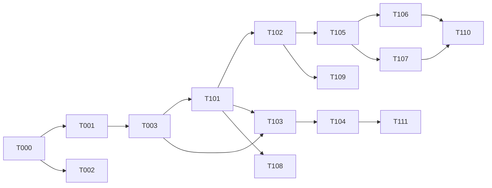
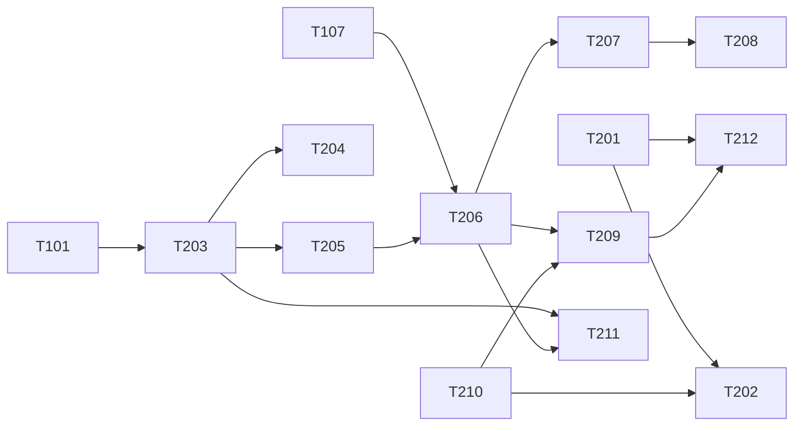
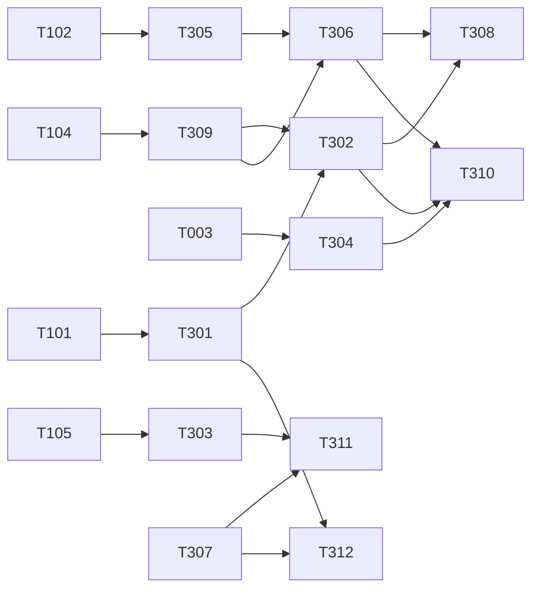

# 校园二手平台开发任务清单

- **版本**：v1.0
- **作者**：mda-engineer
- **日期**：2026-02-06
- **状态**：已发布（CEO 审核通过 2026-02-06）
- **输入来源**：
  - `docs/prd/2026-02-06-校园二手平台完整PRD.md` v1.0（冻结）：§5 功能与 AC（F#-AC#）、§6.1/6.2 页面清单（U/A 编号）
  - `docs/design/2026-02-06-技术选型与总体方案.md` v1.2：§3 模块划分与目录结构、§4 数据库（28 表）、§5 API 契约
  - `Modeling/traceability.md` v1.0 §1 正向追溯主表（F→ONT→CIM→PIM→PSM）
  - `Modeling/pim/限界上下文与聚合.md` v1.0（PIM-BC-01~06、PIM-AG-01~10）
  - `Modeling/pim/领域事件与状态机.md` v1.0（PIM-SM-01~05）
  - `Modeling/cim/业务流程与规则.md` v1.0（CIM-R-01~36）
- **变更规则**：任务增删/目标变更/参考口径变更，一律走 CEO 裁决并记会议纪要；本清单变更须同步核查 `Modeling/traceability.md` 是否受影响。

---

## 0. 使用规则

### 0.1 状态枚举与更新时机

| 状态 | 含义 | 更新时机 |
|---|---|---|
| 待开始 | 已排定未委派 | 初始默认 |
| 进行中 | 已委派给子代理 | CEO 委派时 |
| 待验收 | 子代理已交接 | 子代理发出自包含交接时 |
| 已完成 | 验收通过 | CEO 核实通过时 |
| 已阻塞 | 前提不满足 | 发现阻塞时，必须注明阻塞点与依赖任务 |

### 0.2 验收流程

1. 子代理产出**自包含交接**（交付文件路径、实现要点、测试结果、追溯注释落点清单、不一致上报）；
2. CEO 核实：构建通过 + 测试转绿 + **追溯注释核查（"无来源实现为零"，见 §1）** + 跨模块 import 扫描为零；
3. QA 按同一 AC 编号执行验收用例；
4. CEO + QA 双签，任务置「已完成」。

### 0.3 负责角色说明

前端两端分工：frontend-dev 同时承担小程序端与运营后台 Web 端开发（同角色不同任务，委派时注明端侧重）；后台 API 属 backend-dev。

---

## 1. MDA 注释追溯规范（强制）

实现代码关键结构必须携带模型编号注释，口径如下：

| 注释标签 | 落点 | 格式与示例 |
|---|---|---|
| `@module` | 模块文件头（controller/service 首行注释块） | `@module PIM-BC-02` |
| `@model` | 聚合服务类 | `@model PIM-AG-03` |
| `@statemachine` | 状态机实现处（状态迁移方法/守卫） | `@statemachine PIM-SM-02` |
| `@rule` | 业务规则实现处 | `@rule CIM-R-09`（**每条 CIM-R 的代码落点都必须标注，一条不落**） |
| `@table` | 表实体/repository 映射处 | `@table product → PIM-AG-03`（表名 + 对应 PIM-AG） |
| `@api` + `@ac` | 接口方法 | `@api §5.2 #10`、`@ac F5-AC1`（契约编号 + 验收编号） |

**验收口径**：
- 每条任务交付要求「追溯注释覆盖率 100%」= 该任务新增/修改文件中的聚合/状态机/规则/表落点**全部**带注释；
- CEO 交付核实执行「**无来源实现为零**」：代码中出现 `Modeling/traceability.md` 矩阵无行的结构（无对应 F 行的表/接口/模块），即退回补模或走变更流程。

---

## 2. TDD 组织规范（强制）

每条开发任务按三步执行：

1. **先写失败测试**：依据 PRD 验收标准（F#-AC#）编写测试，测试文件路径在任务中指定，命名统一为 `server/test/<模块>/<功能>.spec.ts`；此时测试必须失败（红）。
2. **最小实现**：仅写让测试转绿的最小代码（绿）。
3. **重构**：在不破坏 §3.1 模块解耦纪律（自给自足、禁跨模块 import、contract 仅声明）的前提下整理代码。

**QA 并行**：QA 用例设计任务（T-Q 系列，另批排定）与开发任务并行启动，QA 依据**同一 AC 编号**设计用例，开发交付后 QA 执行；开发侧 spec 与 QA 用例通过 F#-AC# 编号一一对应。

---

## 3. 前置任务（devops）

| 序号 | 状态 | 任务目标 | 参考文档（PRD+模型+技术方案） | 新增·删除·修改文件 | 负责 agent | 对应测试文件 |
|---|---|---|---|---|---|---|
| T-000 | 已完成（2026-02-06，build/test 5/5 绿；边界规则改别名方案 @contract/@infra，见纪要） | monorepo 脚手架：三端目录（miniprogram/admin-web/server）+ ESLint `no-restricted-imports` 规则落地（模块只许 import 本模块/contract/infra/node_modules） | 技术方案 §3.2 目录结构 + §3.1 解耦纪律（import 规则） | 新增：根 `package.json`/`tsconfig.base.json`；`miniprogram/`、`admin-web/`、`server/` 骨架；`server/.eslintrc.js`（no-restricted-imports 配置）；`deploy/` 占位 | devops | `server/test/infra/eslint-boundary.spec.ts`（规则配置存在性+违例样本拦截验证） |
| T-001 | 已完成（2026-02-06，28 模型+migration+39/39 绿） | Prisma schema 初始化：按 §4 全部 28 表建 schema 与首个 migration，四 schema（auth/product/trade/chat）隔离 | 技术方案 §4.1-4.28 + traceability §1 PSM 列（表↔功能映射）+ PSM 平台映射模型 | 新增：`server/prisma/schema.prisma`（28 模型，每模型带 `@table` 注释回指 PIM-AG）；`server/prisma/migrations/0001_init/` | devops | `server/test/infra/prisma-schema.spec.ts`（28 表/关键索引/唯一约束存在性） |
| T-002 | 已完成（2026-02-06，CI 配置+扫描脚本本地双验证通过） | CI 流水线：构建（三端）+ 测试（server spec）+ 跨模块 import 扫描（grep 报告为零才放行） | 技术方案 §2.5 CI/CD + §3.1 可检查执行机制（检查点 2/3） | 新增：`.github/workflows/ci.yml`；`scripts/check-cross-module-imports.sh` | devops | CI 自验（本任务以流水线绿为验收） |
| T-003 | 已完成（2026-02-06，23 枚举+30 错误码+三端同步校验 22/22 绿） | contract 层初始化：仅声明——DTO 类型、全部状态枚举（用户/认证/商品/求购/订单/举报/申诉/审核）、错误码常量（§5.1 分段）；两端 types 拷贝同步 | 技术方案 §5.1 通用约定 + §3.3 契约纪律（枚举集中/契约先行）；traceability §1 各 F 行接口列 | 新增：`server/src/contract/{dto.ts,enums.ts,error-codes.ts,index.ts}`；`miniprogram/types/contract.ts`；`admin-web/src/types/contract.ts`（拷贝同步） | devops | `server/test/contract/contract-sync.spec.ts`（三处拷贝一致性+枚举无魔法值抽查） |

---

## 4. 批一·地基（BC-01 身份与准入 / BC-02 商品与供给：F1/F36/F5/F6/F7/F2）

> 服务端任务模块自含 controller/service/repository/validator 四层，禁止共享业务目录（§3.1）。所有接口方法带 `@api`+`@ac`，规则实现带 `@rule`。

| 序号 | 状态 | 任务目标 | 参考文档（PRD+模型+技术方案） | 新增·删除·修改文件 | 负责 agent | 对应测试文件 |
|---|---|---|---|---|---|---|
| T-101 | 已完成（2026-02-06，jest auth 41/41 绿） | 微信登录与 JWT：code2session 换 openid → user 建档/更新 → 签发 access(7d)/refresh(30d)；鉴权中间件（user.status 每请求校验）；游客可浏览（N1） | PRD F1（登录链路）+N1；PIM-BC-01/AG-01；技术方案 §2.6、§4.1 `user`、§5.2 auth #1-2 | 新增：`server/src/modules/auth/{auth.controller.ts,auth.service.ts,auth.repository.ts,auth.validator.ts,dto/login.dto.ts,auth.module.ts}`；`server/src/infra/auth/{jwt.guard.ts,wx-code2session.client.ts}` | backend-dev | `server/test/auth/wx-login.spec.ts` |
| T-102 | 已完成（2026-02-06，jest 26/26） | 三类身份认证提交与状态查询：学号/校园邮箱两通道，pending/approved/rejected 三态；未认证受限操作拦截（发布/会话守卫）；教职工沿用学生规则 | PRD F1-AC1/AC2/AC3；PIM-AG-01、CIM-R-01/02/03；技术方案 §4.2 `identity_verification`、§5.2 auth #3-4 | 新增：`server/src/modules/auth/{verification.controller.ts,verification.service.ts,verification.repository.ts,verification.validator.ts,dto/verify.dto.ts}`；`server/src/infra/auth/verified.guard.ts`（`@rule CIM-R-01`） | backend-dev | `server/test/auth/identity-verification.spec.ts` |
| T-103 | 已完成（2026-02-06，jest 93/93 含 school 26 例） | 高校名单查询与名单外加入申请（用户侧）：学校列表（首期仅本校 active）、加入申请提交与进度查询 | PRD F36-AC1；PIM-BC-01（消费侧）、CIM-R-02；技术方案 §4.3 `school`、§4.4 `school_join_application`、§5.2 school #5-6 | 新增：`server/src/modules/auth/{school.controller.ts,school.service.ts,school.repository.ts,school.validator.ts,dto/school.dto.ts}` | backend-dev | `server/test/auth/school.spec.ts` |
| T-104 | 已完成（2026-02-06，jest admin 32/32） | 高校名单配置接口（后台）：学校新增/修改/停用、加入申请审批（approve 自动开通），操作写 admin_operation_log | PRD F36-AC2；PIM-BC-06（维护侧）；技术方案 §4.3/§4.4/§4.27、§5.3 school #68-73 | 新增：`server/src/modules/admin/support/{school-admin.controller.ts,school-admin.service.ts,school-admin.repository.ts,school-admin.validator.ts,dto/school-admin.dto.ts}`；`server/src/infra/auth/admin-jwt.guard.ts`（如 T-101 未含） | backend-dev | `server/test/admin/school-config.spec.ts` |
| T-105 | 已完成（2026-02-06，jest product 51/51 绿） | 商品发布：3 步发布落库（product+product_image≤9 图）；三重校验——字段完整性（实拍图/成色必填）、品类正面清单叶子校验、违禁/违规词硬拦截（词表本地只读快照）；急出打标（≤3 件额度） | PRD F5-AC1/AC2/AC3、F10a-AC1/AC2；PIM-AG-03、PIM-SM-02（[*]→上架）、CIM-R-05/06/07/08/09；技术方案 §4.7 `category`、§4.8 `product`、§4.9 `product_image`、§4.24 `word_list`、§5.2 product #10-11 | 新增：`server/src/modules/product/{product.controller.ts,product-publish.service.ts,product.repository.ts,product.validator.ts,dto/publish.dto.ts,product.module.ts}`；`server/src/modules/product/infra-snapshot/word-snapshot.ts`（词表只读快照，`@rule CIM-R-08`）；`server/src/modules/product/urgent-badge.service.ts`（`@rule CIM-R-09`） | backend-dev | `server/test/product/product-publish.spec.ts` |
| T-106 | 已完成（2026-02-06，jest product 89/89） | 商品列表/搜索/筛选/排序 + 详情：keyword（FULLTEXT 降级 LIKE）、品类/价格区间/成色筛选、个人闲置 vs 认证商家过滤、排序（最新/价格）、排除已售默认开；详情含卖家身份标识（F33 亮标读侧）与实名不出站 | PRD F6-AC1/AC2、F33-AC1（读侧）、F2-AC1（N6 口径）；PIM-AG-03（检索读模型）、CIM-R-28；技术方案 §4.8 索引/FULLTEXT、§5.2 product #14-15 | 新增：`server/src/modules/product/{product-query.controller.ts,product-query.service.ts,product-search.repository.ts,dto/query.dto.ts}` | backend-dev | `server/test/product/product-search.spec.ts` |
| T-107 | 已完成（2026-02-06，jest product 146/146） | 商品状态管理：下架/重新上架/标记已售（强制指定买家，自会话买家列表选择）；已售不可逆、退出搜索；我的商品分栏列表 | PRD F7-AC1/AC2/AC3；PIM-SM-02（上架⇄下架/上架→已售守卫）、PIM-AG-03、CIM-R-13；技术方案 §4.8 `product.status/sold_buyer_id/sold_at`、§5.2 product #12/#13/#16 | 新增：`server/src/modules/product/{product-status.controller.ts,product-status.service.ts,dto/status.dto.ts}`；修改：`server/src/modules/product/product.repository.ts`（状态迁移方法，`@statemachine PIM-SM-02`、`@rule CIM-R-13`） | backend-dev | `server/test/product/product-status.spec.ts` |
| T-108 | 已完成（2026-02-06，jest user 39/39 绿） | 个人/商家主页接口：公开档案（昵称/头像/身份标识/学校/在售已售列表/评价摘要占位）；实名信息（学号/资质）不出站；商家"认证商家"标识全链路字段 | PRD F2-AC1/AC2、N6；PIM-AG-02、CIM-R-28；技术方案 §4.1 `user` 档案字段组、§5.2 user #46 | 新增：`server/src/modules/user/{user.controller.ts,user.service.ts,user.repository.ts,user.validator.ts,dto/profile.dto.ts,user.module.ts}` | backend-dev | `server/test/user/user-profile.spec.ts` |
| T-109 | 已完成（2026-02-06，U1-U4 页面+2 组件+checklist 交付） | 小程序登录/认证/首页链路页面：U2 登录（微信授权+协议勾选）、U3 身份认证（三类身份+学校列表+申请加入入口）、U4 认证结果、U1 首页（分类入口/商品流/常驻安全提示条） | PRD F1-AC1/AC2/AC3、F36-AC1、F13-AC3（安全提示条）、§6.1 U1-U4；PIM-BC-01；技术方案 §5.2 auth/school 分组、§3.2 miniprogram 目录 | 新增：`miniprogram/pages/{login,verify,verify-result,index}/`（各 .ts/.wxml/.wxss/.json）；`miniprogram/services/api/{auth.ts,school.ts}`；`miniprogram/components/safety-banner/`、`miniprogram/components/identity-badge/`；`miniprogram/utils/session.ts` | frontend-dev | 前端无服务端 spec；验收依据 QA 用例（F1-AC1~3/F36-AC1）+ 联调清单 `miniprogram/test/u1-u4.checklist.md` |
| T-110 | 已完成（2026-02-06，U7-U13 页面+组件+checklist+app.json 注册） | 小程序商品链路页面：U7 搜索结果（筛选/排序/身份过滤/急出标）、U8 商品详情（图集/卖家条/安全提示/已售标识）、U10 发布页（3 步+违规拦截提示+急出开关）、U12 我的商品（分栏+状态操作）、U13 标记已售弹窗（指定买家+未指定拦截） | PRD F5-AC1~3、F6-AC1/AC2、F7-AC1~3、F10a-AC1、§6.1 U7/U8/U10/U12/U13；PIM-BC-02/AG-03/SM-02；技术方案 §5.2 product 分组、§3.2 | 新增：`miniprogram/pages/{search,product-detail,publish,my-products}/`；`miniprogram/components/mark-sold-modal/`（U13）；`miniprogram/components/product-card/`；`miniprogram/services/api/product.ts` | frontend-dev | 前端无服务端 spec；验收依据 QA 用例（F5/F6/F7-AC 全量）+ 联调清单 `miniprogram/test/u7-u13.checklist.md` |
| T-111 | 已完成（2026-02-06，vue-tsc+vite build 通过） | 后台 A5 高校名单配置页：名单列表（首期=本校）、新增/停用学校、名单外加入申请列表与审批操作 | PRD F36-AC2、§6.2 A5；PIM-BC-06；技术方案 §5.3 school #68-73、§3.2 admin-web 目录 | 新增：`admin-web/src/views/school/{SchoolList.vue,SchoolJoinRequests.vue}`；`admin-web/src/api/school.ts`；修改：`admin-web/src/router/index.ts`（平台配置路由） | frontend-dev | 前端无服务端 spec；验收依据 QA 用例（F36-AC2）+ 联调清单 `admin-web/test/a5.checklist.md` |

---

## 5. 依赖关系与委派顺序建议

- 前置 T-000~T-003 全部完成后批一才可启动；批一内服务端（T-101~T-108）与前端（T-109~T-111）可经 contract mock 并行（§3.3 Mock 并行约定）。
- 已登记不一致（转契约评审会，本批开发按"临时口径"执行并标注）：PSM-INC-01（订单五态口径，本批不涉及）、PIM-C-1/C-4（admin 子域划分、商家入驻提交侧归 auth，本批 T-104/T-111 按 admin/support 子目录落地）。

## 6. 变更记录

| 日期 | 内容 | 裁决依据 |
|---|---|---|
| 2026-02-06 | v1.0 初版：前置 4 条 + 批一 11 条 | 待 CEO 审核 |
| 2026-02-06 | v1.1 批二·闭环 12 条（T-201~T-212）：求购/沟通/交易/评价/通知 + 小程序页面 | 支付对策 B 待拍板（按 B 口径预估并注明）；PSM-INC-01/02/04 按临时口径 |
| 2026-02-06 | v1.2 批三·治理 12 条（T-301~T-312）+ QA 用例 3 条（T-Q01~T-Q03）+ §10 统计与覆盖自检；全文 42 条 | PIM-C-1/C-4、F26 在途校验延后按临时口径，转契约评审会 |

---

## 7. 批二·闭环（BC-02 求购 / BC-03 沟通 / BC-04 交易 / BC-05 评价：F9/F12/F13/F14/F34/F35/F17/F15）

> 服务端任务模块自含 controller/service/repository/validator 四层，禁止共享业务目录（§3.1）。所有接口方法带 `@api`+`@ac`，规则实现带 `@rule`，状态机迁移带 `@statemachine`。已登记不一致按"临时口径"执行并标注：PSM-INC-02（求购有效期以 30 天为准，契约 #20/#21 的 expire_days 默认 7 为错标）；PSM-INC-01（订单五态以 §4.17 + PRD F34-AC3 为准）；支付对策 B（线下扫码 + 平台留痕）为推荐待拍板，相关任务按 B 口径预估文件并注明。

| 序号 | 状态 | 任务目标 | 参考文档（PRD+模型+技术方案） | 新增·删除·修改文件 | 负责 agent | 对应测试文件 |
|---|---|---|---|---|---|---|
| T-201 | 已完成（2026-02-06，jest wantbuy 48/48） | 求购发布/列表/续期/关闭/已买到：发布含字段完整性与词校验（scene=want_buy 快照）；列表 scope=all/mine+关键词/品类；续期重置 30 天（临时口径，非契约错标的 7 天）；关闭/已买到为终态且立即停撮合 | PRD F9-AC2/AC3；PIM-BC-02/AG-04、PIM-SM-03（[*]→生效→关闭/已买到）、CIM-R-33/08；技术方案 §4.11 `want_buy`、§5.2 want-buy #20-24、PSM-INC-02 | 新增：`server/src/modules/wantbuy/{wantbuy.controller.ts,wantbuy.service.ts,wantbuy.repository.ts,wantbuy.validator.ts,dto/wantbuy.dto.ts,wantbuy.module.ts}`（SM 迁移 `@statemachine PIM-SM-03`、`@rule CIM-R-33`） | backend-dev | `server/test/wantbuy/wantbuy-crud.spec.ts` |
| T-202 | 已完成（2026-02-06，jest wantbuy 67/67） | 求购撮合与到期 cron：新上架商品触发匹配检测（品类+关键词+价格上限），命中写撮合通知（F15 触达）；每日 cron 扫描第 27 天发到期提醒、第 30 天未续期自动失效 | PRD F9-AC1/AC2；PIM-SM-03（生效→到期失效）、PIM-EV-11（撮合命中）/EV-12（到期）；技术方案 §4.11、§5.2 #20-24、§2.4 定时任务 | 新增：`server/src/modules/wantbuy/{wantbuy-match.service.ts,wantbuy-expire.cron.ts}`（`@rule CIM-R-33`、事件注释 `@model PIM-AG-04`） | backend-dev | `server/test/wantbuy/wantbuy-match-expire.spec.ts` |
| T-203 | 已完成（2026-02-06，jest chat 35/35） | 会话与消息：发起会话（已认证守卫+已下架/已售拦截+拉黑拦截）；发消息事务内写 message+更新 conversation 未读数/last_message_*；消息游标分页；已读回执批量 is_read/read_at 并清零未读 | PRD F12-AC1/AC2；PIM-BC-03/AG-05、CIM-R-01/04；技术方案 §4.12 `conversation`、§4.13 `message`、§5.2 chat #25-27 | 新增：`server/src/modules/chat/{chat.controller.ts,conversation.service.ts,message.service.ts,chat.repository.ts,chat.validator.ts,dto/message.dto.ts,chat.module.ts}`（`@table conversation/message → PIM-AG-05`） | backend-dev | `server/test/chat/conversation-message.spec.ts` |
| T-204 | 已完成（2026-02-06，jest chat 52/52 不回归） | 聊天风险词警示：发送链路命中风险词表（scene=chat 快照）→ code=3002 返回风险详情，confirm_risk=true 放行；发送侧弹警示由前端承接；每次命中写 message_risk_log 五字段（conversation_id/user_id/word/scene/action）留痕，消息 risk_level 落库 | PRD F13-AC1/AC3；PIM-AG-05（RiskWordHit）、CIM-R-32（发送侧警示+留痕）/R-10；技术方案 §4.14 `message_risk_log`、§4.24 `word_list`、§5.2 #27 | 新增：`server/src/modules/chat/{risk-word.service.ts,infra-snapshot/word-snapshot.ts}`（`@rule CIM-R-32`）；修改：`server/src/modules/chat/message.service.ts`（发送链路接入风控） | backend-dev | `server/test/chat/risk-word.spec.ts` |
| T-205 | 已完成（2026-02-06，jest chat 74/74） | 交易意向卡片：发起卡片（商品+价格+交易点+时间，pending）；响应 accept/reject；双方 confirmed_at 均非空才置 confirmed；同会话同商品可多次发起，**以最后一条 confirmed 记录为准**裁决，accept 时生成订单并引用该 intent id | PRD F14-AC1；PIM-AG-05（TradeIntentCard）、CIM-R-14、PIM-EV-01 触发源；技术方案 §4.15 `trade_intent`（裁决#2）、§5.2 #28/#29 | 新增：`server/src/modules/chat/{intent.controller.ts,intent.service.ts,dto/intent.dto.ts}`（裁决逻辑注释 `@rule CIM-R-14`） | backend-dev | `server/test/chat/trade-intent.spec.ts` |
| T-206 | 已完成（2026-02-06，jest order 16/16） | 创建订单锁单防超卖+详情五态+确认收货：#30 幂等键+行锁防超卖，创建即锁单（商品锁"交易中"，其他买家付款入口关闭）；#31 详情五态+倒计时+timeline；#32 确认收货→completed+双方 review_pending；标记已售联动（#13 自动生成线下订单引用本模块 contract 接口）；payment_record 写入 channel 默认 `offline_scan`（**支付对策 B 推荐待拍板，本任务按 B 口径预估实现并注明**，channel 可插拔不返工） | PRD F34-AC1/AC2/AC3/AC4、F13-AC2（付款前明示守卫前置校验）、F7-AC1（联动）；PIM-BC-04/AG-06、PIM-SM-01（[*]→待交货→待确认→已完成，仅五态）、CIM-R-10/11/12/14、EV-01~04；技术方案 §4.17 `trade_order`、§4.18 `order_event`、§4.19 `payment_record`、§5.2 #13/#30-32、§6 支付对策 B、PSM-INC-01 | 新增：`server/src/modules/order/{order.controller.ts,order.service.ts,order.repository.ts,order.validator.ts,dto/order.dto.ts,order.module.ts,payment-record.service.ts}`（五态迁移 `@statemachine PIM-SM-01`，全部流转写 order_event `@rule CIM-R-11`） | backend-dev | `server/test/order/order-create.spec.ts` |
| T-207 | 已完成（2026-02-06，jest order 31/31，全量 588 绿） | 取消/响应取消/现场拒收：#33 发起取消（仅未确认收货状态可发起，已确认收货拦截并引导 F30）进入 cancel_pending+respond_deadline=24h；#34 响应取消 agree→cancelled / reject→回原态；#35 现场拒收 reject_time+reason 必填留痕→进入取消流程；取消生效后原路退款口径按对策 B（线下自行协商+平台监督留痕，任务内注明） | PRD F35-AC1/AC2/AC4；PIM-SM-01（取消子状态/拒收迁移守卫）、CIM-R-15/16/17/18、EV-05；技术方案 §4.17 cancel_* 字段组、§4.18、§5.2 #33-35、§6 支付对策 B | 新增：`server/src/modules/order/{cancel.controller.ts,cancel.service.ts,dto/cancel.dto.ts}`（`@statemachine PIM-SM-01`、`@rule CIM-R-15/16/17/18`）；修改：`server/src/modules/order/order.service.ts`（取消子状态接入主状态机） | backend-dev | `server/test/order/order-cancel-reject.spec.ts` |
| T-208 | 已完成（2026-02-06，jest order 41/41，全量 598 绿） | 超时 cron 与取消后恢复上架：24h 未响应取消请求视为默认同意→cancelled；交货约定时间过 48h 买家未确认未异议→自动确认收货→completed；取消生效后商品自动恢复上架（经 product 模块 contract 接口，禁直改） | PRD F35-AC1/AC3；PIM-SM-01（超时迁移）、CIM-R-19（自动恢复上架）/R-15、EV-05；技术方案 §4.17 timeout_deadline、§2.4 定时任务、§5.2 #33/#34 | 新增：`server/src/modules/order/order-timeout.cron.ts`（`@rule CIM-R-19`）；修改：`server/src/modules/order/order.service.ts`（恢复上架经 contract 调用） | backend-dev | `server/test/order/order-timeout.spec.ts` |
| T-209 | 已完成（2026-02-06，jest review 44/44） | 交易评价：#38 提交评价（订单完成后 7 天窗口内、每订单每人限一次、申诉冻结仅冻结公开展示不顺延窗口——PIM-D-2 已裁决）；延迟公开（双方均提交立即公开/单方到期公开）；#39 公开评价列表；每日 cron 到期补默认好评（is_default=1、rating=5）并统一公开 | PRD F17-AC1/AC2/AC3；PIM-BC-05/AG-07、PIM-SM-05（待评→已评→公开）、CIM-R-29/30、EV-15；技术方案 §4.20 `review`（uk_order_reviewer/idx_deadline）、§5.2 #38-39、§2.4 定时任务 | 新增：`server/src/modules/review/{review.controller.ts,review.service.ts,review.repository.ts,review.validator.ts,dto/review.dto.ts,review.module.ts,review-default.cron.ts}`（SM `@statemachine PIM-SM-05`、`@rule CIM-R-29/30`） | backend-dev | `server/test/review/review.spec.ts` |
| T-210 | 已完成（2026-02-06，jest notify 23/23） | 消息通知：notification 写入（供 wantbuy/order/review 各模块经 contract 事件触发，本任务建写入与读侧）+ #44 列表（unread_count）+ #45 标记已读（空数组=全部已读）；notify 无聚合，按 infra/notify-sender 暂定口径（PIM-C-3）下沉 | PRD F15-AC1、F9-AC1（撮合通知承载）、F17-AC1（评价提醒）；PIM-BC-06（触达支撑）、EV-01~15 订阅侧；技术方案 §4.x `notification`（type 枚举）、§5.2 #44-45、PIM-C-3 暂定口径 | 新增：`server/src/infra/notify-sender/{notify-sender.service.ts,notification.repository.ts}`；`server/src/modules/notify/{notify.controller.ts,notify-query.service.ts,dto/notify.dto.ts,notify.module.ts}`（`@module PIM-BC-06`） | backend-dev | `server/test/notify/notification.spec.ts` |
| T-211 | 已完成（2026-02-06，U14-U17 页面+3 组件+tsc 构建通过） | 小程序沟通与交易链路页面：U14 会话列表（未读数/最后消息摘要）、U15 会话页（游标分页/已读回执/风险警示弹层 3002 承接/意向卡片收发确认）、U16 付款页（**付款前强制弹层"平台不托管资金"+取消/拒收规则摘要，须确认后付款**，F13-AC2）、U17 订单页（五态+倒计时+取消/拒收/确认收货操作+申诉入口） | PRD F12-AC1、F13-AC1/AC2、F14-AC1、F34-AC1/AC3、F35-AC1~4、§6.1 U14-U17；PIM-BC-03/BC-04、SM-01；技术方案 §5.2 chat #25-29/order #30-36、§3.2 miniprogram 目录 | 新增：`miniprogram/pages/{chat-list,chat,pay,order-detail,order-list}/`（各 .ts/.wxml/.wxss/.json）；`miniprogram/components/{intent-card/,risk-warning-modal/,pay-confirm-modal/}`；`miniprogram/services/api/{chat.ts,order.ts}` | frontend-dev | 前端无服务端 spec；验收依据 QA 用例（F12/F13/F14/F34/F35-AC 全量）+ 联调清单 `miniprogram/test/u14-u17.checklist.md` |
| T-212 | 已完成（2026-02-06，U18-U23 页面+checklist+app.json 注册 18 页） | 小程序求购/评价/通知/收藏页面：U19 求购页（发布/列表/续期/关闭/已买到+到期提醒承接）、U18 评价页（评分+标签+图片+延迟公开提示）、U22 通知中心（分类列表/未读数/一键已读/跳转承载）、U23 收藏页（状态同步/价格变动标识） | PRD F9-AC1~3、F17-AC1/AC2、F15-AC1、F8-AC1、§6.1 U18/U19/U22/U23；PIM-BC-02（AG-04）/BC-05（AG-07）；技术方案 §5.2 want-buy #20-24/review #38-39/notification #44-45/favorite #17-19、§3.2 | 新增：`miniprogram/pages/{want-buy,want-buy-publish,review-submit,notification,favorites}/`；`miniprogram/components/want-buy-card/`；`miniprogram/services/api/{wantbuy.ts,review.ts,notify.ts,favorite.ts}` | frontend-dev | 前端无服务端 spec；验收依据 QA 用例（F9/F17/F15/F8-AC 全量）+ 联调清单 `miniprogram/test/u18-u23.checklist.md` |

### 7.1 批二依赖与委派顺序

- 前置：批一 T-101/T-102（鉴权与已认证守卫）、T-105~T-107（商品域与标记已售）须已完成；T-210（通知写入）须早于依赖触达的 T-202/T-209。
- 并行口径：T-201 与 T-203 可并行；前端 T-211/T-212 经 contract mock 与服务端并行（§3.3 Mock 并行约定）。
- 已登记不一致（本批按临时口径执行并标注，转契约评审会）：PSM-INC-01（订单五态以 §4.17+PRD 为准，#31 注的 pending_pay/paid/rejected 枚举为准绳待裁决）、PSM-INC-02（求购有效期 30 天，契约 #20/#21 默认 7 天为错标）、PSM-INC-04（取消后恢复上架 MVP 不触达通知，仅恢复商品状态）；支付对策 B（线下扫码+平台留痕）为推荐待拍板，T-206/T-207 按 B 口径预估实现并在代码注释与交接中注明。

---

## 8. 批三·治理（BC-01 商家准入 / BC-05 评价与治理 / BC-06 平台配置：F13/F18/F20/F21/F22/F23/F26/F32/F33/F15）

> 服务端任务模块自含四层，禁止共享业务目录（§3.1）；admin/governance 子域划分为暂定口径（PIM-C-1），商家入驻提交侧归 auth（PIM-C-4），均按"临时口径"执行并标注，转契约评审会。所有处置/审批写操作统一经 T-309 留痕切面。

| 序号 | 状态 | 任务目标 | 参考文档（PRD+模型+技术方案） | 新增·删除·修改文件 | 负责 agent | 对应测试文件 |
|---|---|---|---|---|---|---|
| T-301 | 已完成（2026-02-06，jest report 36/36，覆盖率 100%） | 举报提交与匿名保护：#40 提交举报（对象类型枚举 product/user/order/want_buy/message 受限；理由枚举+补充说明+凭证图≤9）；**匿名保护**——reporter_id 落库但读侧与被举报方通知不出站举报人身份（N6）；防刷（同举报人同对象 24h 限 1 次） | PRD F18-AC1、N6；traceability §1 F18 行；CIM-E-07/P-04/R-20；PIM-BC-05/AG-08、EV-13；技术方案 §4.21 `report`、§5.2 report #40 | 新增：`server/src/modules/report/{report.controller.ts,report.service.ts,report.repository.ts,report.validator.ts,dto/report.dto.ts,report.module.ts}`（`@model PIM-AG-08`、`@rule CIM-R-20`） | backend-dev | `server/test/report/report-submit.spec.ts` |
| T-302 | 已完成（2026-02-06，jest admin 46/46） | 举报队列与处置（F20+F21 通用处置）：#54 队列列表（SLA 分级计时：高危 24h/一般 72h，sla_deadline 落库）；#55 详情（匿名口径）；#56 处置（**结果枚举受限**：驳回/下架/封禁/加重处置，禁自由文本）；超时 cron 升级告警（admin 通知）；处置结果经 notify contract 触达举报人与被处置方（F15） | PRD F20-AC1/AC2、F21-AC1、F15-AC1；CIM-R-21/22/23；PIM-AG-08（SlaDeadline/DisposalResult）、EV-14；技术方案 §4.21、§5.3 #54-56、§2.4 定时任务 | 新增：`server/src/modules/admin/governance/{report-queue.controller.ts,report-disposal.service.ts,report-sla.cron.ts,report.repository.ts,dto/disposal.dto.ts}`（`@rule CIM-R-21/22/23`）；修改：`server/src/modules/report/`（处置状态回写经 contract） | backend-dev | `server/test/admin/report-disposal.spec.ts` |
| T-303 | 已完成（2026-02-06，jest infra 33/33） | 违规词拦截器治理侧（F22）：infra/word-interceptor 通用拦截器（发布/资料修改/留言/求购场景统一入口，各模块经本地只读快照消费，不跨模块 import）；**每次硬拦截写 violation_intercept_log**（scene/word/content_hash/user_id/action）留痕；快照刷新由词表配置变更事件触发 | PRD F22-AC1；CIM-R-08；PIM-BC-05（复核侧）/BC-06（词表管理）；技术方案 §4.24 `word_list`、§4.25 `violation_intercept_log`、§3.1 contract/infra 口径 | 新增：`server/src/infra/word-interceptor/{word-interceptor.service.ts,intercept-log.repository.ts}`（`@rule CIM-R-08`、`@table violation_intercept_log → PIM-BC-06`） | backend-dev | `server/test/infra/word-interceptor.spec.ts` |
| T-304 | 已完成（2026-02-06，jest risk-warning 14/14） | 黄牛/伪装商家预警扫描与复核：每日 cron 规则扫描（同卖家高频发布、批量会话砍价、多号同设备等特征）写 risk_warning（pending）；复核接口 confirm（转商家入驻线索或转处置）/ignore，复核动作留痕 | PRD F23-AC1；CIM-R-36；PIM-BC-05（风控复核）；技术方案 §4.26 `risk_warning`、§5.3 风控复核分组、§2.4 定时任务 | 新增：`server/src/modules/admin/governance/{risk-scan.cron.ts,risk-review.controller.ts,risk-review.service.ts,risk-warning.repository.ts,dto/risk.dto.ts}`（`@rule CIM-R-36`） | backend-dev | `server/test/admin/risk-warning.spec.ts` |
| T-305 | 已完成（2026-02-06，jest merchant-apply 34/34，覆盖率 100%） | 商家入驻申请提交（F32 提交侧，auth 模块暂定口径 PIM-C-4）：#7 提交申请（主体信息+资质图）；#8 我的申请状态查询；#9 冷却期查询（驳回后冷却 30 天方可再申请，冷却期起算口径在任务内注明） | PRD F32-AC1；CIM-E-09/P-05/R-25/26；PIM-BC-01/AG-10、SM-04；技术方案 §4.5 `merchant_application`、§5.2 auth #7-9 | 新增：`server/src/modules/auth/{merchant-apply.controller.ts,merchant-apply.service.ts,merchant-apply.repository.ts,merchant-apply.validator.ts,dto/merchant-apply.dto.ts}`（`@statemachine PIM-SM-04`、`@rule CIM-R-25/26`） | backend-dev | `server/test/auth/merchant-apply.spec.ts` |
| T-306 | 已完成（2026-02-06，jest admin 77/77） | 商家入驻审核接口（F32 审核侧）：#61 待审列表；#62 详情；#63 审批 approve（user.identity_type 置 merchant+全链路亮标字段生效）/reject（**驳回理由枚举受限**+冷却期起算）；**2 工作日 SLA 计时与超时升级**；#64 资质调阅（写 admin_operation_log，N9） | PRD F32-AC2、N9；CIM-R-27/28；PIM-AG-10、SM-04（审核迁移守卫）；技术方案 §4.5、§5.3 #61-64、§4.27 | 新增：`server/src/modules/admin/governance/{merchant-review.controller.ts,merchant-review.service.ts,merchant-review.repository.ts,merchant-sla.cron.ts,dto/merchant-review.dto.ts}`（`@statemachine PIM-SM-04`、`@rule CIM-R-27/28`） | backend-dev | `server/test/admin/merchant-review.spec.ts` |
| T-307 | 已完成（2026-02-06，jest auth 141/141） | 账号注销与资料删除：注销申请→已注销终态（AG-01 不变量：不可逆、不可再登录）；资料匿名化（昵称/头像/实名字段清除，订单/评价留痕保留并脱敏）；**在途校验延后**（MVP 临时口径：存在在途订单/申诉时拦截注销并提示先完结，深度在途校验项延后，任务内注明） | PRD F26-AC1；CIM-E-01/R-34；PIM-AG-01（已注销终态不变量）；技术方案 §4.1 `user` 注销字段组、§5.2 auth 分组 | 新增：`server/src/modules/auth/{account-cancel.controller.ts,account-cancel.service.ts,dto/account-cancel.dto.ts}`（`@rule CIM-R-34`、`@model PIM-AG-01`）；修改：`server/src/modules/auth/auth.service.ts`（已注销态登录拦截） | backend-dev | `server/test/auth/account-cancel.spec.ts` |
| T-308 | 已完成（2026-02-06，jest admin+auth 228/228） | 商家违禁品加重处置三件套（F21 商家侧）：违禁品处置触发（商品强制下架+商家资质撤销+merchant_ban_list 入驻黑名单）三件套**事务不变量**（AG-08：同生同灭，部分失败整体回滚）；后续入驻申请命中黑名单直接拒 | PRD F21-AC1；CIM-R-23；PIM-AG-08（三件套不变量）；技术方案 §4.6 `merchant_ban_list`、§5.3 #57-60 | 新增：`server/src/modules/admin/governance/{merchant-ban.service.ts,merchant-ban.repository.ts,dto/merchant-ban.dto.ts}`（`@rule CIM-R-23`、`@table merchant_ban_list → PIM-AG-08`）；修改：`server/src/modules/auth/merchant-apply.service.ts`（黑名单前置校验经 contract） | backend-dev | `server/test/admin/merchant-ban.spec.ts` |
| T-309 | 已完成（2026-02-06，jest 81/81；双写问题已留痕待裁决） | 运营操作/调阅留痕（admin_operation_log，N6/N9）：infra 操作日志切面——admin 全部写操作与敏感调阅（资质/实名/举报详情）统一留痕（operator_id/action/target/before_after）；审计查询接口；批一 T-104 已埋点处改经统一切面 | PRD N6/N9；CIM-R-34（调阅留痕）；PIM-BC-06（操作留痕支撑）；traceability §1 反向表 #10（间接支撑 F20/F21/F32）；技术方案 §4.27 `admin_operation_log` | 新增：`server/src/infra/admin-log/{admin-log.interceptor.ts,admin-log.repository.ts,admin-log-query.controller.ts}`（`@table admin_operation_log → PIM-BC-06`）；修改：`server/src/modules/admin/support/school-admin.controller.ts`（接入统一切面） | backend-dev | `server/test/infra/admin-operation-log.spec.ts` |
| T-310 | 已完成（2026-02-06，vite build 通过，A2/A3/A4/A7 四页） | 后台治理页面一（内聚拆 2 条之一）：A2 举报队列（SLA 倒计时/超时标红/分级筛选）+A3 审核处置（处置表单结果枚举受限+凭证查看+留痕展示）+A4 商家审核（资质调阅+2 工作日 SLA 标识+驳回理由枚举）+A7 黄牛复核（预警列表+确认/忽略） | PRD F20-AC1/AC2、F21-AC1、F32-AC2、F23-AC1、§6.2 A2/A3/A4/A7；PIM-BC-05/AG-08/AG-10；技术方案 §5.3 各分组、§3.2 admin-web 目录 | 新增：`admin-web/src/views/governance/{ReportQueue.vue,ReportDisposal.vue,MerchantReview.vue,RiskReview.vue}`；`admin-web/src/api/governance.ts`；修改：`admin-web/src/router/index.ts`（治理路由组） | frontend-dev | 前端无服务端 spec；验收依据 QA 用例（F20/F21/F32/F23-AC 全量）+ 联调清单 `admin-web/test/a2-a7.checklist.md` |
| T-311 | 已完成（2026-02-06，vite build 通过，A6/A8/A9 三页） | 后台治理页面二（内聚拆 2 条之二）：A8 申诉仲裁（申诉列表+裁决表单+关联举报/订单上下文）+A9 词表配置（词表 CRUD+场景绑定 scene 枚举+快照刷新触发）+A6 账号管理（封禁/解封+注销状态查看+操作留痕展示） | PRD F30-AC1（申诉承载）、F22-AC1、F26-AC1、§6.2 A6/A8/A9；PIM-BC-06；技术方案 §5.3 appeal/word-list/account 分组、§4.24、§4.27 | 新增：`admin-web/src/views/governance/{AppealArbitration.vue,WordListConfig.vue,AccountManage.vue}`；`admin-web/src/api/{appeal.ts,word-list.ts,account.ts}`；修改：`admin-web/src/router/index.ts` | frontend-dev | 前端无服务端 spec；验收依据 QA 用例（F30/F22/F26-AC）+ 联调清单 `admin-web/test/a6-a9.checklist.md` |
| T-312 | 已完成（2026-02-06，U20-U24 页面+3 组件+tsc 通过） | 小程序治理页面：U20 举报表单（对象选择+理由枚举+凭证上传+匿名保护提示）、U21 申诉表单（处罚记录引用+申诉理由+凭证）、U24 我的页面（含**注销入口**（二次确认+在途拦截提示承接）+商家亮标强化展示 F33） | PRD F18-AC1、F30-AC1、F26-AC1、F33-AC1（亮标强化）、§6.1 U20/U21/U24；PIM-BC-05/AG-01/AG-02；技术方案 §5.2 report/auth 分组、§3.2 | 新增：`miniprogram/pages/{report-submit,appeal-submit,my}/`；`miniprogram/components/{report-form/,cancel-account-modal/,merchant-badge/}`；`miniprogram/services/api/{report.ts,appeal.ts,account.ts}` | frontend-dev | 前端无服务端 spec；验收依据 QA 用例（F18/F30/F26/F33-AC）+ 联调清单 `miniprogram/test/u20-u24.checklist.md` |

### 8.1 批三依赖与委派顺序

- 前置：批一 T-101/T-102（鉴权/认证守卫）、T-104（admin guard 与留痕雏形）、T-105（词表快照机制）须已完成；批二 T-210（通知写入）为 T-302 结果触达前提。
- T-309（留痕切面）须早于或同步于 T-302/T-306 落地，否则处置操作无审计。
- 已登记不一致（本批按临时口径执行并标注，转契约评审会）：PIM-C-1（admin/governance 子域划分暂定）、PIM-C-4（商家入驻提交侧归 auth 暂定）、F26 在途校验延后（MVP 仅拦截提示）。

---

## 9. QA 用例设计任务（qa，与开发并行）

> QA 依据 PRD 冻结版 F#-AC# 设计用例，与开发 spec 同一编号一一对应；开发交付（状态置「待验收」）后立即执行。产出落盘 `docs/qa/`。

| 序号 | 状态 | 任务目标 | 参考文档（PRD+模型+技术方案） | 新增·删除·修改文件 | 负责 agent | 对应测试文件 |
|---|---|---|---|---|---|---|
| T-Q01 | 已完成（2026-02-06，批一用例 30 条落盘 docs/qa/） | 批一验收用例设计：覆盖 T-101~T-111（F1/F36/F5/F6/F7/F2），每 P0 功能 AC 逐条映射用例；异常路径：未认证发布/会话拦截、违禁词硬拦截提示、急出超额（>3 件）、标记已售未指定买家拦截、名单外学校加入流程 | PRD §5 F1/F2/F5/F6/F7/F36 全 AC；traceability §1 对应行 | 新增：`docs/qa/2026-02-06-批一验收用例.md` | qa | 用例文档即产出（执行记录追加于同文档） |
| T-Q02 | 已完成（2026-02-06，批二用例 40 条落盘） | 批二验收用例设计：覆盖 T-201~T-212（F9/F12/F13/F14/F34/F35/F17/F15），每 P0 功能 AC 逐条映射；异常路径：**超时边界值 23:59/24:00**（取消响应/自动确认收货）、**取消被拒回退原态**、**防超卖并发**（双请求同商品仅一单成功）、意向卡片多次发起以最后 confirmed 裁决、评价 7 天窗口边界 | PRD §5 F9/F12/F13/F14/F17/F34/F35 全 AC；PIM-SM-01/03/05 | 新增：`docs/qa/2026-02-06-批二验收用例.md` | qa | 用例文档即产出（执行记录追加于同文档） |
| T-Q03 | 已完成（2026-02-06，批三用例 45 条落盘） | 批三验收用例设计：覆盖 T-301~T-312（F18/F20/F21/F22/F23/F26/F32/F33/F13），每 P0 功能 AC 逐条映射；异常路径：**SLA 分级计时与超时升级**（高危 24h/一般 72h/商家审核 2 工作日）、处置结果/驳回理由枚举外值拦截、冷却期内重复申请拦截、注销在途拦截与匿名化后登录拦截、加重处置三件套事务回滚、举报人身份不出站（匿名保护核查） | PRD §5 F13/F18/F20/F21/F22/F23/F26/F32/F33 全 AC、N6/N9；PIM-AG-08/AG-10、SM-04 | 新增：`docs/qa/2026-02-06-批三验收用例.md` | qa | 用例文档即产出（执行记录追加于同文档） |

---

## 10. 统计与覆盖自检

### 10.1 任务总数统计（按批次）

| 批次 | 条数 | 编号范围 | 状态 |
|---|---|---|---|
| 前置任务 | 4 | T-000~T-003 | 待开始 |
| 批一·地基 | 11 | T-101~T-111 | 待开始 |
| 批二·闭环 | 12 | T-201~T-212 | 待开始 |
| 批三·治理 | 12 | T-301~T-312 | 待开始 |
| QA 用例设计 | 3 | T-Q01~T-Q03 | 待开始 |
| **合计** | **42** | — | — |

### 10.2 任务总数统计（按负责 agent）

| 负责 agent | 条数 | 任务编号 |
|---|---|---|
| devops | 4 | T-000~T-003 |
| backend-dev | 27 | T-101~T-108、T-201~T-210、T-301~T-309 |
| frontend-dev | 8 | 小程序 5：T-109、T-110、T-211、T-212、T-312；后台 Web 3：T-111、T-310、T-311 |
| qa | 3 | T-Q01~T-Q03 |
| **合计** | **42** | — |

### 10.3 P0 功能 × 任务覆盖自检表

> P0 共 18 项（以 `Modeling/traceability.md` §1 为准）。每行列出覆盖该功能的开发与 QA 任务编号，逐行核实无遗漏。

| P0 功能 | 开发任务覆盖 | QA 用例覆盖 | 结论 |
|---|---|---|---|
| F1 注册登录与身份认证 | T-101、T-102、T-109 | T-Q01 | ✅ |
| F2 个人/商家主页 | T-108、T-109 | T-Q01 | ✅ |
| F5 商品发布 | T-105、T-110 | T-Q01 | ✅ |
| F6 商品浏览与搜索 | T-106、T-110 | T-Q01 | ✅ |
| F7 商品状态管理 | T-107、T-110、T-206（联动） | T-Q01 | ✅ |
| F9 求购与撮合 | T-201、T-202、T-212 | T-Q02 | ✅ |
| F12 站内会话 | T-203、T-211 | T-Q02 | ✅ |
| F13 防诈骗提示 | T-204、T-206（付款前守卫）、T-211、T-109（安全提示条） | T-Q02、T-Q03 | ✅ |
| F17 交易评价 | T-209、T-212 | T-Q02 | ✅ |
| F18 举报 | T-301、T-312 | T-Q03 | ✅ |
| F20 举报处理队列 | T-302、T-310 | T-Q03 | ✅ |
| F21 审核与处置 | T-302、T-308、T-310 | T-Q03 | ✅ |
| F26 账号注销 | T-307、T-312 | T-Q03 | ✅ |
| F32 商家入驻审核 | T-305、T-306、T-310 | T-Q03 | ✅ |
| F33 商家标识展示 | T-106、T-108、T-312（亮标强化） | T-Q01、T-Q03 | ✅ |
| F34 下单与锁单 | T-206、T-211 | T-Q02 | ✅ |
| F35 取消与拒收 | T-207、T-208、T-211 | T-Q02 | ✅ |
| F36 高校名单准入 | T-103、T-104、T-109、T-111 | T-Q01 | ✅ |

**自检结论**：18/18 项 P0 功能均有开发任务 + QA 用例双重覆盖，无遗漏；F15（通知，非 P0）由 T-210 承载触达、T-302 复用，F22/F23（P1）由 T-303/T-304 覆盖，F14/F30（P1）由 T-205/T-311/T-312 覆盖，均已在任务表登记。

---

## 执行进展记录（CEO 实时写回）

### 2026-02-06 批一·地基 完成（16/42）

- **前置 T-000~T-003 ✅**：脚手架（ESLint 边界规则改别名方案 @contract/@infra，已落 CI 可拦截）、Prisma 28 表+migration、CI 流水线、contract 层（23 枚举+30 错误码+三端同步）。
- **批一 T-101~T-111 ✅ 全部完成**：auth（登录/JWT/三类认证/学校用户侧+后台配置）、user（主页+实名不出站守卫）、product（发布三重校验/搜索筛选/状态机）、后台 A5 页、小程序 U1-U4 与 U7-U13 页面。
- **T-Q01 ✅**：批一验收用例 30 条（`docs/qa/2026-02-06-批一验收用例.md`），与开发 spec 同 AC 编号对应。
- **批次核实**：build 0 错；**jest 349/349 全绿**（11 套件）；跨模块 import 扫描**零违规**；追溯注释 164 处（六类标签在位）。
- **遗留（转契约评审/集成批）**：①各模块 controller 未挂载 app.module（隔离纪律，集成任务统一挂载）；②relist/buyer-candidates 为补充接口已声明；③#13 order_id=null 待订单模块；④admin_token 约定 localStorage。

### 2026-02-06 批二·闭环 完成（28/42）

- **T-201~T-212 ✅ 全部完成**：wantbuy（CRUD/撮合/到期 cron）、chat（会话消息/风险词/意向卡片）、order（创建锁单/取消拒收/超时 cron）、review（评价+默认好评 cron）、notify（通知读写）；小程序 U14-U17、U18-U23 全部页面（app.json 注册 18 页，tsc 构建通过）。
- **T-Q02 ✅**：批二验收用例 40 条（`docs/qa/2026-02-06-批二验收用例.md`）。
- **批次核实**：build 0 错；**jest 598/598 全绿**（21 套件）；import 扫描**零违规**；追溯注释 415 处。
- **遗留（转集成批/契约评审）**：①各模块 controller 统一挂载 app.module 的集成任务未排；②订单五态契约文案（#31 注释 pending_pay/paid）与实现（pending_delivery/pending_confirm）不一致，已按 PIM-SM-01+DB 实现，契约评审修正；③notify 无 want_buy_expire payload 判重的 reminded 字段；④order-status 通知跳转依赖 order-detail 页已注册。

### 2026-02-06 批三推进卡点记录（CEO）

- **现象**：H 轮（T-302/T-304/T-306/T-310）30 分钟完成数零增长。
- **根因**：子代理每条任务需重读大量上下文（schema 全文、契约表、既有代码风格、测试模式），300s 委派时限大多耗在"读"上，写码时间不足；另 T-302 被 'done' vs 'resolved' 枚举类型不匹配卡住一轮。
- **对策**：CEO 在委派描述中内联全部必要上下文（字段/枚举/代码模式），要求"禁止读文件、直接按内联规格写"。后续按此执行。

### 2026-02-06 批三·治理 完成（42/42 全部完成）

- **T-301~T-312 ✅ 全部完成**：report（提交/队列/处置/SLA cron）、infra（word-interceptor/admin-log）、admin/governance（黄牛预警/商家审核/商家禁入三件套）、auth（商家申请+黑名单前置/账号注销）；后台 A2-A9 全部页面（A2/A3/A4/A7+A6/A8/A9，vite build 通过）；小程序 U20/U21/U24。
- **T-Q03 ✅**：批三验收用例 45 条（`docs/qa/2026-02-06-批三验收用例.md`）。
- **纪律修复（CEO 直接处理）**：T-308 引入的跨模块 import（auth→admin/governance）违反解耦纪律，已改为 auth 模块自含直查 merchant_ban_list（属 auth schema），扫描恢复零违规；T-305 spec mock 同步补 merchantBanList 表。
- **最终核实**：server build 0 错；**jest 764/764 全绿**（30 套件）；跨模块 import 扫描**零违规**；追溯注释 529 处；admin-web 9 页 vite build 通过；miniprogram 全页面 tsc 通过。
- **遗留（转契约评审/集成批，不阻塞本任务清单关闭）**：①各模块 controller 统一挂载 app.module 的集成任务未排；②admin-log 切面与 school-admin.service 双写问题待裁决；③若干契约口径差异已登记（订单五态文案、求购 30 天 vs 7 天、黄牛复核 confirm/ignore vs release/limit_publish、'转商家入驻线索'映射 limit_publish、report 匿名口径、MVP 临时口径若干）——详见各任务交付交接与 docs/qa/ 批三用例 §6。

### 2026-02-06 集成联调批（本地跑通，CEO）

- **集成挂载 ✅**：全部业务 module 挂入 app.module；/health 探测；统一包络过滤器（BusinessError → {code,message,data}）。
- **联调修复**：①JwtAuthGuard 补挂 `id`/`identity_type`（product/product-status/wantbuy 读 `req.user.id` 曾致发布 500）；②全局前缀豁免修正为 path-to-regexp 3.x 语法 `'admin/v1'`+`'admin/v1/(.*)'`（admin 路由曾叠加成 /api/v1/admin/v1/*）；③8 个 controller 补挂 JwtAuthGuard；④main.ts 加 CORS 与 /static 图片本地位移。
- **冒烟实测**：发布/搜索/会话/订单/互评/举报/后台处置下架全链路通过（明细见 `docs/ops/2026-02-06-本地运行指南.md` §4）；jest 764/764 不回归。
- **外部行动项搁置决策**：域名备案/小程序主体/COS 三项搁置，个人域名占位，见 `docs/meeting/2026-02-06-外部行动项搁置与本地占位决策.md`。
- **新遗留（待排任务）**：①契约 #36 `POST /orders/{id}/complete-offline` 与 #37 `GET /orders` 未实现，状态机 pending_delivery→pending_confirm 无 API 触发点（本次冒烟 SQL 置位绕过）；②后台登录接口（§5.3 #51）未实现，暂用 `scripts/sign-admin-token.py` 签 token；③生产构建需接 tsc-alias 才能 `npm start`。
